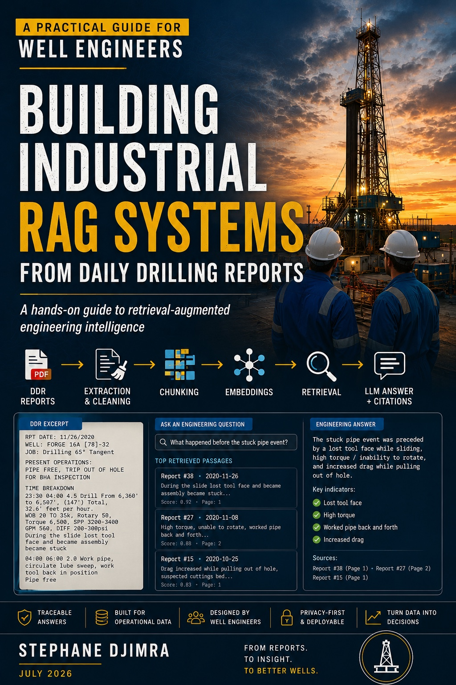
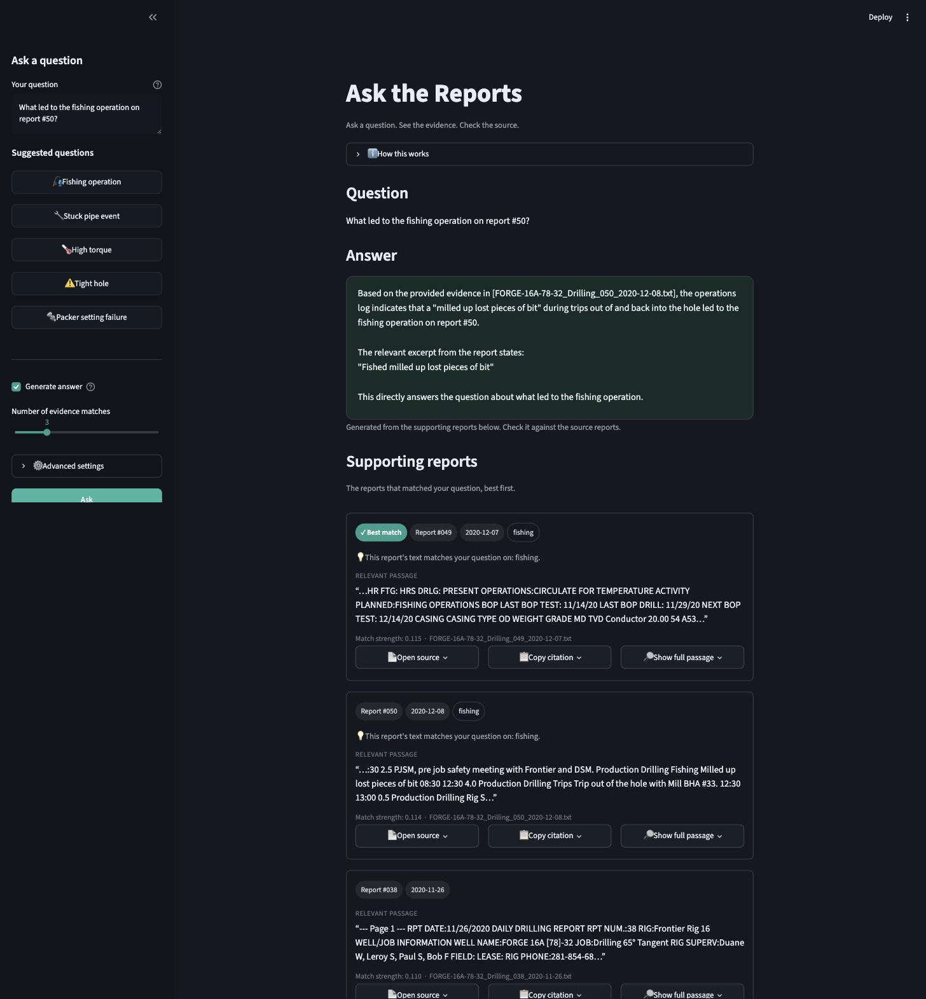

# Building Industrial RAG Systems from Daily Drilling Reports

**First time here? Jump straight to [Start Here](#start-here).**

This repository contains the chapters, code, and sample data for **Building Industrial RAG Systems from Daily Drilling Reports** — a hands-on, build-as-you-go book that teaches retrieval-augmented generation (RAG) to well, drilling, and completions engineers, assuming zero prior programming experience.

<a href="https://djimrastephane.github.io/ddr-rag-book/"></a>

In *Building Industrial RAG Systems from Daily Drilling Reports*, you build a working RAG system from scratch, one chapter at a time: extracting text from a real Daily Drilling Report (DDR) PDF, expanding oilfield shorthand, searching an archive by keyword and then by meaning, and finally generating cited, evidence-backed answers to real engineering questions — no machine learning background assumed, no black-box product involved.

Every example uses real, publicly available Daily Drilling Reports from **Utah FORGE** — a Department of Energy-funded geothermal research well — not synthetic stand-ins. A real stuck-pipe event, a real packers-fail-to-fishing sequence, and a real reporting gap all appear exactly as filed.

### Why Not Just Ctrl+F the PDFs?

A fair question before investing any time here: why not just open the DDRs and search for a phrase, or dump them in a folder and `grep`?

Because the words you'd search for are rarely the only words the archive uses for the same event. In this book's real Utah FORGE archive, searching `"stuck pipe"` finds the report where the pipe actually got stuck — but misses the very next day's report entirely, because that one talks about `"tight hole"`, `"high torque"`, and a `"decision to pull out of hole"` instead. Same underlying story, one day later, invisible to a keyword search because it never uses the word "stuck." A keyword search only ever matches spelling; it has no notion that these phrases describe the same event, and it can't handle oilfield shorthand (`BHA`, `WOB`, `MWD`) unless every abbreviation has already been expanded by hand.

RAG fixes both problems. It retrieves passages by *meaning*, not exact wording — the same `"stuck pipe"` query that missed the follow-up report entirely under keyword search finds it anyway once retrieval works by meaning (Chapter 4). And instead of handing back a folder of PDFs for an engineer to read and cross-reference themselves, it generates a synthesized answer with citations back to the exact reports it drew from — the difference between *"here are some files that might be relevant"* and *"here's what happened, and here are the two reports that prove it."*

This book builds that system from scratch, starting exactly where keyword search breaks (Chapter 3) and ending with a traceable, evidence-backed answer engine (Chapter 5 onward) — grounded the entire way in one real archive, not a synthetic demo.

### What You're Building

The box below is a **plain-text preview of the kind of answer the finished system produces** — not code to type or run yourself, and not something Chapter 5 reaches on its own. It shows a real interaction: the question, the generated answer, and the exact reports backing every claim in it. Nothing here is invented; both claims in the answer are directly quoted from the real report text.

```
Question: What led to the fishing operation on report #50?

Answer: On report #49 (2020-12-07), the crew attempted multiple times
to set packers on BHA #32, but pressure readings showed the ball did
not seat and the packers failed to set. They tripped out with the
packer assembly and picked up a fishing BHA (#33) that same day. On
report #50 (2020-12-08), that fishing run milled up lost pieces of bit.

Evidence:
  FORGE-16A-78-32_Drilling_049_2020-12-07.pdf
  FORGE-16A-78-32_Drilling_050_2020-12-08.pdf
```

That's the destination. By Chapter 5 you'll have a working RAG system — retrieve, generate, cite — running on a real local model; answering a *cross-report* question like this one, which stitches the cause in report #49 to the outcome in report #50, takes the chunking and hybrid retrieval Part II adds. Either way: a question, an answer, and the exact source reports backing it. No black box.

- Link to the [official source code repository](https://github.com/djimrastephane/ddr-rag-book)
- [Read the book online](https://djimrastephane.github.io/ddr-rag-book/)
- Latest stable release: [v1.1.1](https://github.com/djimrastephane/ddr-rag-book/releases/tag/v1.1.1) — see [CHANGELOG.md](CHANGELOG.md) for what's new in each release
- License: code is [MIT](LICENSE); the book's text is [CC BY 4.0](LICENSE-CONTENT.md)

To get a copy of this repository, click the [Download ZIP](https://github.com/djimrastephane/ddr-rag-book/archive/refs/heads/main.zip) button, or run the following in a terminal:

```bash
git clone https://github.com/djimrastephane/ddr-rag-book.git
```

Never used a terminal or Git before? That's exactly what **Start Here** and **Part 0** below are for — nothing past this point assumes you already know how.

---

# Start Here

This README has one job: get you to successfully run Chapter 1. Everything else in this file is reference material for later.

If this is your first Python project, do these five things in order:

1. Read **[Part 0: Preparing Your Python Workshop](https://djimrastephane.github.io/ddr-rag-book/chapters/chapter_00.html)** — installs Python and gets your project folder ready. No prior experience assumed.
2. Run `setup_check.py` — one command that confirms everything is working before you touch a real report.
3. Run **[Chapter 1](https://djimrastephane.github.io/ddr-rag-book/chapters/chapter_01.html)** — extract text from a real Daily Drilling Report PDF.
4. Watch it happen on your own screen — real rig-floor language, printed by code you ran yourself.
5. Continue sequentially, one chapter at a time. Each chapter builds on the last.

| Step | Typical time |
|---|---|
| Setup (Part 0) | ~30–45 minutes |
| Chapter 1 | ~20 minutes |
| Chapter 2 | ~20 minutes |
| Chapter 3 | ~30 minutes |

That's under two hours from "nothing installed" to searching a real drilling report archive by keyword. You don't need to understand everything before you start — you need to run the first command. Everything else follows from there.

---

# Your Learning Journey

Each arrow below is one or two chapters of real, working code — not a diagram of what's theoretically possible.

```
DDR PDF
   ↓
Text Extraction
   ↓
Text Cleaning
   ↓
Keyword Search
   ↓
Semantic Search
   ↓
RAG
   ↓
Traceable Answers
   ↓
Operational Intelligence
```

By the last arrow, you're not reading about RAG systems — you built one, and you understand every piece of it.

## What You Will Build and Learn

By the end of the book you will have built seven real, working artifacts — not seven topics you read about — and be able to:

- ✓ **PDF extraction pipeline** — extract text from drilling reports
- ✓ **Abbreviation expansion engine** — expand oilfield abbreviations automatically
- ✓ **Keyword search engine** — search historical operations by keyword
- ✓ **Semantic search engine** — find reports by meaning, not just exact wording
- ✓ **Industrial RAG system** — a complete RAG pipeline, end to end
- ✓ **Traceable answer engine** — generate traceable, evidence-backed answers
- ✓ **Cross-well sequence detector** — detect operational patterns across wells
- ✓ Evaluate retrieval quality with real numbers, not guesswork

## Who This Book Is For

This book is written for:

- Well Engineers
- Completion Engineers
- Intervention Engineers
- Drilling Engineers
- Production Engineers
- Digital Oilfield Professionals
- Energy Data Scientists

If you've ever read a DDR and wished you could search years of them in seconds, this book is for you.

## Who This Book Is Not For

This book is probably not for you if:

- you want a theoretical machine learning textbook
- you want a mathematical treatment of transformers
- you want to train foundation models
- you already build production-scale RAG systems professionally

None of that is a criticism — it just means your time is better spent elsewhere.

## Expected Background

**Helpful:**

- operational experience
- experience reading DDRs
- comfort in Excel
- curiosity

**Not required:**

- Python
- AI or machine learning
- software engineering
- Git
- Linux

## How Long Does Each Chapter Take

| Chapter | Typical time |
|---|---|
| Part 0 | 30–45 min |
| Chapter 1 | 20 min |
| Chapter 2 | 20 min |
| Chapter 3 | 30 min |
| Chapter 4 | 30 min |
| Chapter 5 | 45 min |
| Chapter 6 | 30 min |
| Chapter 7 | 30 min |
| Chapter 8 | 40 min |
| Chapter 9 | 40 min |
| Chapter 10 | 30 min |
| Chapter 11 | 30 min |
| Chapter 12 | 45 min |

There's no need to do this in one sitting — most readers spread it across several days, a chapter or two at a time.

## Minimum Computer Requirements

**Minimum:**

- 8 GB RAM
- 5 GB free disk space
- a modern CPU (nothing from the last ~6 years should struggle)

**Recommended:**

- 16 GB RAM, which makes Part II's heavier chapters more comfortable

**No GPU required. No cloud account required. No paid API required.** Everything in this book runs locally on an ordinary laptop. The embedding model used from Chapter 4 onward (`all-MiniLM-L6-v2`) and the vector index in Chapter 8 (`faiss-cpu`) are both deliberately chosen to be small and fast on CPU. Chapter 5's `llm_call` argument is provider-agnostic — you *can* plug in a hosted API if you want one, but nothing about following this book requires it.

## Choose Your Workshop

| Environment | Recommended for |
|---|---|
| [Jupyter Notebook](https://djimrastephane.github.io/ddr-rag-book/appendix/appendix_a1_jupyter.html) | Learning and experimentation |
| [VS Code](https://djimrastephane.github.io/ddr-rag-book/appendix/appendix_a2_vscode.html) | General coding |
| [PyCharm Community](https://djimrastephane.github.io/ddr-rag-book/appendix/appendix_a3_pycharm.html) | Larger projects |
| [Positron](https://djimrastephane.github.io/ddr-rag-book/appendix/appendix_a4_positron.html) | Data science workflows |
| [Terminal only](https://djimrastephane.github.io/ddr-rag-book/appendix/appendix_a5_terminal.html) | Minimal setup |

**There is no wrong choice. All examples run identically in every one of these.** Part 0 covers general setup; each link above has a short, dedicated walkthrough for that specific tool.

## First Success Checkpoint

You are ready for Chapter 1 when:

- ✅ Python runs
- ✅ `setup_check.py` runs successfully
- ✅ the sample DDR files exist in `datasets/sample_ddrs/`
- ✅ your virtual environment is active

All four checks are covered in Part 0 — if any of them aren't true yet, that's exactly what it's for.

## Common Reader Journeys

**"I am a drilling engineer with no coding experience."**
→ Start with Part 0 and proceed sequentially, one chapter at a time.

**"I already know Python."**
→ Skip Part 0 and start directly at Chapter 1.

**"I already build RAG systems professionally."**
→ Skim Part I for context, then start at Part II (Chapter 6), where OCR gating, hybrid retrieval, and traceability are covered.

## What Makes This Book Different

- Uses real DDRs rather than synthetic examples
- Uses public operational data — no confidentiality concerns, nothing invented
- Assumes zero programming experience
- Focuses on well engineering problems, not generic AI demos
- Emphasizes traceability over generation quality
- Teaches industrial constraints (scanned reports, retrieval failures, evaluation) rather than a toy happy-path

---

# Table of Contents

Everything below this point is reference material — you don't need to read it to get started (see **Start Here** above). It's here for when you want to jump to a specific chapter, check a file, or come back to something later.

Please note that this `README.md` file is a Markdown (`.md`) file — GitHub renders it automatically, and if you downloaded this repository as a ZIP, any Markdown previewer will too. The book's chapters, however, are written as `.qmd` (Quarto Markdown) files, which GitHub's file viewer shows as plain unformatted source. Read them properly formatted at [djimrastephane.github.io/ddr-rag-book](https://djimrastephane.github.io/ddr-rag-book/), which renders automatically from this repository.

For the full repository layout (folder tree, part/chapter file map) see [`book/README.md`](book/README.md).

[](https://github.com/djimrastephane/ddr-rag-book/actions/workflows/publish.yml)
[](https://github.com/djimrastephane/ddr-rag-book/actions/workflows/tests-linux.yml)
[](https://github.com/djimrastephane/ddr-rag-book/actions/workflows/tests-windows.yml)
[](https://github.com/djimrastephane/ddr-rag-book/actions/workflows/tests-macos.yml)

- [Troubleshooting](https://djimrastephane.github.io/ddr-rag-book/chapters/chapter_00.html#troubleshooting) (Part 0, Section 0.11), plus [Appendix A, Section 5](https://djimrastephane.github.io/ddr-rag-book/appendix/appendix_a_environment_setup.html#troubleshooting) for rendering/dependency issues
- [Releases](https://github.com/djimrastephane/ddr-rag-book/releases) and [CHANGELOG.md](CHANGELOG.md) track what's changed since v1.0.0; the live site above always reflects the latest `main`, which may be ahead of the most recent tagged release

Chapter titles in the table below link to the rendered, readable page for that reason.

| Chapter | Main Code (Quick Access) | All Code + Supplementary |
|---|---|---|
| [Part 0: Preparing Your Python Workshop](https://djimrastephane.github.io/ddr-rag-book/chapters/chapter_00.html) | [setup_check.py](book/code/setup_check.py) | - |
| [Ch 1: Reading Your First DDR](https://djimrastephane.github.io/ddr-rag-book/chapters/chapter_01.html) | - [read_ddr.py](book/code/chapter_01/read_ddr.py)<br/>- [chapter_01_explore.ipynb](book/notebooks/chapter_01_explore.ipynb) | [./book/code/chapter_01](book/code/chapter_01) |
| [Ch 2: Cleaning Operational Text](https://djimrastephane.github.io/ddr-rag-book/chapters/chapter_02.html) | - [expand_abbreviations.py](book/code/chapter_02/expand_abbreviations.py)<br/>- [chapter_02_explore.ipynb](book/notebooks/chapter_02_explore.ipynb) | [./book/code/chapter_02](book/code/chapter_02) |
| [Ch 3: Searching DDRs](https://djimrastephane.github.io/ddr-rag-book/chapters/chapter_03.html) | - [keyword_search.py](book/code/chapter_03/keyword_search.py)<br/>- [chapter_03_explore.ipynb](book/notebooks/chapter_03_explore.ipynb) | [./book/code/chapter_03](book/code/chapter_03) |
| [Ch 4: Semantic Search](https://djimrastephane.github.io/ddr-rag-book/chapters/chapter_04.html) | - [semantic_search.py](book/code/chapter_04/semantic_search.py)<br/>- [chapter_04_explore.ipynb](book/notebooks/chapter_04_explore.ipynb) | [./book/code/chapter_04](book/code/chapter_04) |
| [Ch 5: First RAG System](https://djimrastephane.github.io/ddr-rag-book/chapters/chapter_05.html) | - [first_rag.py](book/code/chapter_05/first_rag.py)<br/>- [chapter_05_explore.ipynb](book/notebooks/chapter_05_explore.ipynb) | [./book/code/chapter_05](book/code/chapter_05) |
| [Ch 6: Scanned Reports and OCR Quality Gates](https://djimrastephane.github.io/ddr-rag-book/chapters/chapter_06.html) | - [ocr_quality_gate.py](book/code/chapter_06/ocr_quality_gate.py) | [./book/code/chapter_06](book/code/chapter_06) |
| [Ch 7: Chunking That Respects Report Structure](https://djimrastephane.github.io/ddr-rag-book/chapters/chapter_07.html) | - [token_chunking.py](book/code/chapter_07/token_chunking.py) | [./book/code/chapter_07](book/code/chapter_07) |
| [Ch 8: Vector Databases at Scale](https://djimrastephane.github.io/ddr-rag-book/chapters/chapter_08.html) | - [build_faiss_index.py](book/code/chapter_08/build_faiss_index.py)<br/>- [build_full_archive.py](book/code/chapter_08/build_full_archive.py) | [./book/code/chapter_08](book/code/chapter_08) |
| [Ch 9: Hybrid Retrieval and Reranking](https://djimrastephane.github.io/ddr-rag-book/chapters/chapter_09.html) | - [hybrid_search.py](book/code/chapter_09/hybrid_search.py) | [./book/code/chapter_09](book/code/chapter_09) |
| [Ch 10: Traceable Answers and Hallucination Mitigation](https://djimrastephane.github.io/ddr-rag-book/chapters/chapter_10.html) | - [traceable_answers.py](book/code/chapter_10/traceable_answers.py) | [./book/code/chapter_10](book/code/chapter_10) |
| [Ch 11: Evaluating Retrieval Quality](https://djimrastephane.github.io/ddr-rag-book/chapters/chapter_11.html) | - [eval_metrics.py](book/code/chapter_11/eval_metrics.py) | [./book/code/chapter_11](book/code/chapter_11) |
| [Ch 12: Sequence Detection: Building Toward Cross-Well Intelligence](https://djimrastephane.github.io/ddr-rag-book/chapters/chapter_12.html) | - [torque_trend_check.py](book/code/chapter_12/torque_trend_check.py) | [./book/code/chapter_12](book/code/chapter_12) |
| [Appendix A: Environment Setup](https://djimrastephane.github.io/ddr-rag-book/appendix/appendix_a_environment_setup.html) | - | [./book/appendix](book/appendix) |
| Appendices A1–A5: Jupyter / VS Code / PyCharm / Positron / Terminal-only | - | [./book/appendix](book/appendix) |
| [Appendix B: Oilfield Abbreviation Glossary](https://djimrastephane.github.io/ddr-rag-book/appendix/appendix_b_oilfield_glossary.html) | - | [appendix_b_oilfield_glossary.qmd](book/appendix/appendix_b_oilfield_glossary.qmd) |

## Companion Pipeline

[**DDR_UTAH_FORGE**](https://github.com/djimrastephane/DDR_UTAH_FORGE) is a separate, public repository: a real, working DDR intelligence pipeline built specifically against this book's public archive, which Part II's chapters reference for verified real-world numbers (a real 1,428-chunk global index, a real detected reporting gap, and so on). This book's own code never depends on it — every chapter's script in `book/code/chapter_NN/` runs standalone against the committed sample archive. See [Appendix A, Section 3](https://djimrastephane.github.io/ddr-rag-book/appendix/appendix_a_environment_setup.html#the-companion-pipeline-for-part-ii) for how to clone it and how the two projects relate.

### What this becomes

The companion pipeline wraps the same retrieval, citation, and gap-detection logic the book builds into a searchable interface over the whole archive — you ask a question and get a cited answer back across every report at once.

_A screenshot of that interface is coming in a future revision._

<!-- TODO(author): add a real screenshot of the DDR Intelligence / Streamlit interface
     at book/figures/app_screenshot.png and uncomment the image below. Do NOT substitute
     a mockup or an AI-generated UI image as evidence of the real app. -->
<!--  -->

## Exercises

Every chapter includes a **Practical exercise** (a guided, checkable task using the real sample archive) and a **Challenge exercise** (a harder, more open-ended extension). Reference solutions for challenge exercises live alongside each chapter's code, e.g. [`book/code/chapter_01/challenge/`](book/code/chapter_01/challenge).

## Automated Tests

Every chapter's real code — not a simplified stand-in — is tested against the actual sample DDR archive in [`book/tests/`](book/tests), on Linux, Windows, and macOS. Run them yourself from the `book/` directory:

```bash
pip install -r requirements.txt
pytest -v
```

## Bonus Material

Every chapter ends with a **Repository files** table listing the exact files — in this repository and, for Part II, in the companion pipeline — that back everything the chapter claims. A few worth knowing about on their own:

- [`book/code/chapter_01/build_sample_archive.py`](book/code/chapter_01/build_sample_archive.py) and [`book/code/chapter_08/build_full_archive.py`](book/code/chapter_08/build_full_archive.py) reproduce this book's curated 10-report and full 76-report Utah FORGE archives from the public source.
- Each chapter's **Field notes** callout is a real, independently-verified result checked against the actual archive before being written down — not an illustrative estimate.
- [`book/appendix/appendix_b_oilfield_glossary.qmd`](book/appendix/appendix_b_oilfield_glossary.qmd) extends Chapter 2's abbreviation dictionary with common oilfield terms beyond what this specific archive contains.

## Questions, Feedback, and Contributing to This Repository

Questions, corrections (an oilfield abbreviation that's wrong for your basin, a chapter that assumes something it shouldn't, a bug in the code), and feedback are all welcome via [GitHub Issues](https://github.com/djimrastephane/ddr-rag-book/issues).

## A Note on AI-Assisted Development

The ideas, engineering examples and technical validation are the author's. AI tools including Claude were used to accelerate coding, editing and documentation tasks.

## Citation

If you find this book or its code useful for your work, please consider citing it.

Chicago-style citation:

> Djimra Stephane, Soulanoudjingar. *Building Industrial RAG Systems from Daily Drilling Reports*. 2026. https://github.com/djimrastephane/ddr-rag-book.

BibTeX entry:

```bibtex
@book{ddr-rag-book,
  author  = {Djimra Stephane Soulanoudjingar},
  title   = {Building Industrial RAG Systems from Daily Drilling Reports},
  year    = {2026},
  url     = {https://djimrastephane.github.io/ddr-rag-book/},
  github  = {https://github.com/djimrastephane/ddr-rag-book}
}
```
