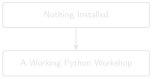

# Part 0: Preparing Your Python Workshop {#sec-chapter-00 .unnumbered}

::: {.content-visible when-format="html"}
::: {.pipeline-diagram}
{.diagram-light width="220"}
{.diagram-dark width="220"}
:::
:::

::: {.content-visible when-format="pdf"}
{width="220"}
:::

::: {.chapter-status}
Progress: **Part 0 — Environment Setup** (before Chapter 1) &nbsp;·&nbsp; **Estimated time:** 20–30 min &nbsp;·&nbsp; **Difficulty:** 🟢 Beginner
:::

Before you can read a single DDR with code, you need somewhere to do the
work. Think of it this way:

> The IDE is just the workshop. Python is the engine. The code is the
> tool. The DDR archive is the job.

You wouldn't judge a rig by which brand of hard hat the crew wears, and
you don't need to fight over which code editor is "correct" before you
start. Any of the environments in this section will run every example in
this book. Pick the one that feels least intimidating and move on — you
can always switch later once you know what you're doing.

This section assumes you have never installed Python, never opened a
terminal, and never used Git. If you've done some of this before, skim
ahead to whichever step you actually need.

## 0.1 What you need

Five things, all free, all one-time setup:

- **Python** — the language every example in this book is written in.
- **A code editor or notebook environment** — where you'll read and edit
  the book's code. Section 0.2 helps you choose one.
- **A terminal** — a text-based window where you type commands for the
  computer to run. Section 0.4 explains this in plain English if the word
  is new to you.
- **Git** — a tool for downloading (and later updating) this book's
  companion code and sample DDR files in one step. If you'd rather not
  install it, Section 0.6 shows a no-Git alternative.
- **The companion repository** — this book's actual code and sample DDR
  archive, which you'll download once in Section 0.6.

None of these cost money, and none of them lock you into a particular way
of working. Let's go through them one at a time.

## 0.2 Choosing your environment

You do not need to use any particular editor to follow this book. Every
example runs the same way — as a plain Python file, or a plain code
cell — no matter which of these you pick:

| Environment | Best for | Notes |
|---|---|---|
| Jupyter Notebook | Learning and exploration | Good for step-by-step code, runs in a web browser |
| VS Code | General coding | Free, very common in companies, lots of online help available |
| PyCharm Community | Python projects | Strong project structure, a bit heavier to install |
| Positron | Data science workflows | Good for notebooks and scripts side by side |
| Terminal only | Minimal setup | Works everywhere, nothing extra to install |

If you genuinely don't know which to pick: install **VS Code**. It's
free, widely used outside this book too, and Appendix A2 walks through
every click. If you'd rather not install anything beyond Python itself,
the **Terminal only** route (Appendix A5) works identically — you'll just
type commands instead of clicking buttons.

Whichever you choose, Appendices A1–A5 give you a short, dedicated guide
for that specific environment once you've finished this section.

## 0.3 Installing Python

::: {.callout-tip title="Engineering Translation: Python"}
**Python** is the engine everything in this book runs on — the same code
runs whether it's read by a notebook, an editor, or the plain terminal.
Installing Python once gives every tool in Section 0.2 something to run
your code with.
:::

This book was written and tested against Python 3.11 or later. Version
matters because some of the libraries used later in the book (starting
with Chapter 4) rely on features only present in newer Python releases —
an older version can fail in confusing ways that have nothing to do with
your code.

**Check whether Python is already installed.** Open a terminal (Section
0.4 shows you how) and type:

```bash
python --version
```

**Expected output:** something like `Python 3.11.9` or higher. If you see
that, skip ahead to Section 0.4.

**If it fails** — an error like `command not found` or a version starting
with `2.` — try:

```bash
python3 --version
```

Many Mac and Linux systems only recognise `python3`, not the shorter
`python`. If `python3 --version` shows 3.11 or later, use `python3` in
place of `python` for every command in this book.

**If neither command works,** Python isn't installed yet. Download it
from [python.org/downloads](https://www.python.org/downloads/) and run
the installer for your operating system — on Windows, make sure to check
the box labelled "Add python.exe to PATH" during installation, since
that's what lets the `python` command work from a terminal at all.

## 0.4 Opening a terminal

::: {.callout-tip title="Engineering Translation: Terminal"}
A **terminal** (sometimes called a command window, console, or shell) is
a plain text window where you type instructions for the computer to run,
one line at a time, instead of clicking buttons. It looks intimidating
the first time and is genuinely just a way of talking to your computer
directly.
:::

**How to open one:**

- **Mac:** open Spotlight (Cmd+Space), type `Terminal`, press Enter.
- **Windows:** open the Start menu, type `Command Prompt` or
  `PowerShell`, press Enter. Either works for this book.
- **Linux:** usually Ctrl+Alt+T, or search your applications menu for
  "Terminal".

Once it's open, you'll see a prompt — some text followed by a blinking
cursor, waiting for you to type. Try these four commands, one at a time,
pressing Enter after each:

| Command | What it does | Windows equivalent |
|---|---|---|
| `pwd` | Prints your current folder ("print working directory") | `cd` (typed alone) |
| `ls` | Lists the files and folders here | `dir` |
| `cd <folder>` | Moves into a folder, e.g. `cd Documents` | `cd <folder>` (same) |
| `mkdir <name>` | Creates a new folder | `mkdir <name>` (same) |

**Expected output:** `pwd` prints a path like `/Users/yourname` (Mac/Linux)
or `C:\Users\yourname` (Windows). `ls`/`dir` prints a list of whatever
files and folders are in your current location — it may be empty if the
folder is new.

**If a command isn't recognised:** double-check the spelling — these
commands are typed exactly as shown, with no capital letters.

## 0.5 Creating the project folder

If you plan to use Git in the next step, you can skip this — `git clone`
creates its own folder for you. This step is here for readers who'd
rather set up a folder by hand first, or who will use the ZIP download
option instead of Git.

In your terminal:

```bash
mkdir ddr-rag-book
cd ddr-rag-book
```

**What this does:** `mkdir ddr-rag-book` creates a new, empty folder
named `ddr-rag-book` inside wherever your terminal currently is. `cd
ddr-rag-book` moves your terminal *into* that folder, so every command
you type next happens there.

**Expected output:** no message printed — silence means it worked. Run
`pwd` (or `cd` alone on Windows) to confirm you're now inside
`ddr-rag-book`.

## 0.6 Getting the companion repository

::: {.callout-tip title="Engineering Translation: Git and repository"}
A **repository** ("repo" for short) is a folder of files — in this case,
this book's chapters, code, and sample DDR PDFs — tracked and shared
online. **Git** is the tool that copies a repository from the internet
onto your own computer, and later lets you pull down any updates. Think
of `git clone` as downloading a shared project folder in one command,
instead of clicking "download" on dozens of individual files.
:::

If Git is installed, run this in your terminal:

```bash
git clone https://github.com/djimrastephane/ddr-rag-book.git
cd ddr-rag-book
```

**What this does:** downloads the entire book repository — every
chapter's code, the sample DDR PDFs, everything — into a new folder named
`ddr-rag-book`, then moves your terminal into it.

**Expected output:** a handful of progress lines (`Cloning into
'ddr-rag-book'...`, `Receiving objects...`) ending without an error.

**If `git` isn't recognised:** you don't need to install it just for
this. Go to the repository's page on GitHub, click the green **Code**
button, choose **Download ZIP**, then extract the ZIP file anywhere on
your computer. `cd` into the extracted folder (Section 0.4 shows how) and
continue from there — everything else in this book works identically
either way.

## 0.7 Creating a Python environment

::: {.callout-tip title="Engineering Translation: Virtual environment"}
A **virtual environment** is a clean toolbox for this book. It keeps this
project's packages separate from any other Python project on your
computer, so installing something here can never conflict with, break,
or get mixed up with anything else you have installed.
:::

From inside the `ddr-rag-book` folder:

```bash
python -m venv .venv
```

**What this does:** creates a new, empty toolbox named `.venv` inside your
project folder. Nothing is installed into it yet — that's the next
section.

**Expected output:** no message, and a new `.venv` folder appears (check
with `ls` or `dir`).

**If it fails** with something like `No module named venv` on Linux, your
Python installation split the `venv` module into a separate package —
install it with `sudo apt install python3-venv` (Ubuntu/Debian) and try
again.

Now activate it — this tells your terminal "use tools from *this*
toolbox until I say otherwise":

**Mac/Linux:**

```bash
source .venv/bin/activate
```

**Windows:**

```bash
.venv\Scripts\activate
```

**Expected output:** your terminal prompt changes to show `(.venv)` at
the start of the line. That's your confirmation it worked — you'll need
to see that `(.venv)` every time you come back to work on this book.

## 0.8 Installing packages

::: {.callout-tip title="Engineering Translation: pip and packages"}
A **package** (also called a library or a dependency) is a piece of
software someone else already wrote and tested, ready for you to use
instead of writing it yourself — this book uses one to read PDFs, one to
compare text meaning, and so on. **pip** is Python's own tool for
downloading packages into your active virtual environment.
:::

With your virtual environment active (you should still see `(.venv)` in
your prompt), run:

```bash
pip install -r requirements.txt
```

**What this does:** reads `requirements.txt` — a plain list of every
package this book needs, one per line — and installs all of them in one
go, into your `.venv` toolbox only.

**Expected output:** a scrolling list of `Collecting ...` and
`Successfully installed ...` lines. This can take a minute or two the
first time; some packages (starting with Chapter 4's) are large.

**If it fails:** see Section 0.11 below — the most common causes are
being in the wrong folder, or forgetting to activate `.venv` first.

## 0.9 Running the first test

Before touching any real DDR, confirm the whole chain — Python, the
virtual environment, the installed packages — actually works together.
This book's repository already includes a one-line check at
`code/setup_check.py`:

```python
print("DDR RAG workshop is ready.")
```

Run it:

```bash
python code/setup_check.py
```

**Expected output:**

```
DDR RAG workshop is ready.
```

If you see that exact line, everything from Sections 0.3 through 0.8
worked. If you see an error instead, it names exactly what's still
missing — jump to Section 0.11.

::: {.callout-note title="Notebook users"}
If you're working in Jupyter Notebook or another notebook environment
instead of running files from the terminal, you don't need
`setup_check.py` as a file at all — just open a new notebook cell, type
`print("DDR RAG workshop is ready.")`, and run that cell directly. Every
code example in this book can be run either way.
:::

## 0.10 Running the first book script

Now run the actual script Chapter 1 builds — this book's very first
real, working tool:

```bash
python code/chapter_01/read_ddr.py datasets/sample_ddrs/FORGE-16A-78-32_Drilling_038_2020-11-26.pdf
```

**What this does:** opens one real Daily Drilling Report PDF (already
included in the repository you downloaded in Section 0.6) and prints its
full text straight to your terminal.

**Expected output:** several dozen lines of real report text, starting
with a header block (`RPT DATE:11/26/2020`, `WELL NAME:FORGE 16A
[78]-32`...) and ending with a time breakdown that includes the line
`During the slide lost tool face and became assembly became stuck`.

**If it fails:**

- `ModuleNotFoundError: No module named 'pdfplumber'` — your virtual
  environment isn't active, or Section 0.8 didn't complete. Re-run
  Sections 0.7 and 0.8.
- `No such file or directory` — you're not inside the `ddr-rag-book`
  folder, or the path is mistyped. Run `pwd` (or `cd` alone on Windows)
  to check where you are.

If this printed real report text, Part 0 is complete — Chapter 1 explains
exactly how this script works, line by line.

## 0.11 Troubleshooting

| Symptom | Likely cause | What to do |
|---|---|---|
| `python: command not found` | Python isn't installed, or isn't on your system's PATH | Try `python3` instead. If that also fails, reinstall Python from python.org, checking "Add to PATH" on Windows. |
| `pip: command not found` | Same as above, or your virtual environment isn't active | Confirm `(.venv)` shows in your prompt (Section 0.7); if not installed at all, try `python -m pip` instead of `pip` directly. |
| Commands run, but nothing looks like it worked | You're in the wrong folder | Run `pwd` (or `cd` alone on Windows) and compare it to where you expect to be; `cd` back into `ddr-rag-book`. |
| `No such file or directory` / `FileNotFoundError` | Wrong folder, or a typo in the file path | Run `ls` (or `dir`) to see what's actually there; file and folder names are case-sensitive on Mac/Linux. |
| A package import fails (`ModuleNotFoundError`) | Virtual environment isn't active, or Section 0.8 wasn't run | Re-activate `.venv` (Section 0.7), then re-run `pip install -r requirements.txt`. |
| `Permission denied` | Your user account doesn't have write access to that folder | Don't use `sudo`/administrator install for this project — instead, work inside a folder you own, like your home directory or Documents. |
| Windows path errors (e.g. backslashes look wrong) | Windows uses `\` in paths, this book's examples are written with `/` | Both usually work in a modern Windows terminal, but if a command fails specifically because of slashes, replace `/` with `\` in that one command. |

::: {.callout-caution title="CHECKPOINT — Part 0"}
- [x] `python --version` (or `python3 --version`) shows 3.11 or later
- [x] Your terminal prompt shows `(.venv)`
- [x] `pip install -r requirements.txt` finished without errors
- [x] `python code/setup_check.py` printed `DDR RAG workshop is ready.`
- [x] `python code/chapter_01/read_ddr.py datasets/sample_ddrs/FORGE-16A-78-32_Drilling_038_2020-11-26.pdf` printed real report text
:::

::: {.callout-tip .built-box title="✓ WHAT YOU BUILT"}
**A working Python environment** — Python, an active virtual environment,
every package this book needs, and a folder with the real Utah FORGE DDR
archive already in it, ready to run the companion repository's tests and
every chapter that follows.
:::

If all five checkpoint items are true, you have a working Python
workshop, and Chapter 1 starts exactly where this section leaves off. If
you'd like a step-by-step guide specific to the environment you chose in
Section 0.2, see Appendices A1 (Jupyter Notebook), A2 (VS Code), A3
(PyCharm Community), A4 (Positron), or A5 (Terminal only).
