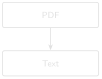

# Reading Your First DDR {#sec-chapter-01}

::: {.content-visible when-format="html"}
::: {.pipeline-diagram}
{.diagram-light width="160"}
{.diagram-dark width="160"}
:::
:::

::: {.content-visible when-format="pdf"}
{width="160"}
:::

::: {.chapter-status}
Progress `█░░░░░░░░░░░` **1 / 12** &nbsp;·&nbsp; **Estimated time:** 45–60 min &nbsp;·&nbsp; **Difficulty:** 🟢 Beginner
:::

## Learning objectives

By the end of this chapter, you will be able to:

- Explain why DDR PDFs are hard for software to read, and the difference
  between a *digital-native* PDF and a *scanned* one.
- Extract raw text from a digital-native PDF using Python.
- Write a script that processes a single DDR, or an entire folder of them,
  from the command line.
- Save extracted text so it's ready for the cleaning work in Chapter 2.

::: {.callout-important title="Before you start"}
This chapter assumes your Python workshop is already set up. If you
haven't done that yet, complete [Part 0](chapter_00.qmd) first and
confirm:

- Python runs (`python --version` or `python3 --version` shows 3.11 or
  later).
- Your virtual environment is active (your terminal prompt shows
  `(.venv)`).
- Packages are installed (`pip install -r requirements.txt` finished
  without errors).
- The sample DDR files exist (`datasets/sample_ddrs/` has ten PDFs).
- `python code/setup_check.py` prints `DDR RAG workshop is ready.`

If all five are true, you're ready for this chapter. If any of them
aren't, Part 0, Section 0.11 has a troubleshooting table for exactly this
situation.
:::

## Operational Problem

It's Monday morning. Oumy, the drilling engineer, asks on the call:
*"Have we had a stuck pipe event on this well before? What happened, and
how was it resolved?"*
The answer is somewhere in the DDR archive — but that archive is 76 PDF
files, named inconsistently by whatever software produced them, and the
one report that matters is buried in there like a single page in a filing
cabinet with no index. Nobody wants to open 76 PDFs one at a time to
answer a question that took ten seconds to ask.

This book uses a real, publicly available archive to solve exactly that
problem: the Daily Drilling Reports from **Utah FORGE** — a Department of
Energy-funded research project at the University of Utah, drilling and
testing an enhanced geothermal system (EGS) well, **FORGE 16A(78)-32**, in
Beaver County, Utah. Because it's a public research well rather than a
commercial operator's confidential asset, its DDRs are openly available —
which means every example in this book is real, traceable text, not an
invented stand-in.

Before we can search this archive, summarize it, or ask it questions, we
need the words inside those PDFs available to a computer as plain text.
That's the whole job of this chapter: given one PDF, get its text into
something Python can work with. Nothing clever yet — no search, no
abbreviation handling, no AI. Just a reliable way to turn a PDF into text.
Everything in this book is built on top of getting this first step right.

## Example DDR extract

::: {.callout-note title="Real DDR excerpt — report #38, FORGE 16A(78)-32, 2020-11-26"}
```
RPT DATE:11/26/2020
DAILY DRILLING REPORT RPT NUM.:38
WELL NAME:FORGE 16A [78]-32 JOB:Drilling 65° Tangent
PRESENT OPERATIONS:PIPE FREE, TRIP OUT OF HOLE FOR BHA INSPECTION

TIME BREAKDOWN
23:30 04:00 4.5 Drill From 6,360' to 6,507', (147') Total,
32.6' feet per hour.
WOB 20 TO 35k, Rotary 50, Torque 6,500, SPP 3200-3400 GPM 560,
DIFF 200-300psi
During the slide lost tool face and became assembly became stuck
04:00 06:00 2.0 Work pipe, circulate lube sweep, work tool back in position
Pipe free
```
:::

This is one of ten real reports curated for Part I, spanning the well's
actual timeline from rig-up in October 2020 through this stuck-pipe day
in November and a fishing operation in December. Every excerpt in Part I
is genuine, unedited report text — no anonymisation was needed, because
this data is already public. Notice that report #38 answers the morning
call question directly — *if* you happen to open this one file out of 76.
That's the gap this chapter closes.

## Theory

A PDF is not a text file wearing a costume. It's a page-description format:
instructions for *drawing* characters at specific coordinates, not a
stream of text with a beginning and an end. Two DDRs that look identical on
screen can be built completely differently under the hood:

- **Digital-native PDFs** were generated directly from software (in this
  case, WellEz, the drilling data system that produced every report in
  this archive). The text was placed on the page as actual character
  data, so a library can recover it.
- **Scanned PDFs** are photographs of paper reports. There is no character
  data at all — just a picture of a page. Extracting text from these
  requires optical character recognition (OCR), which we cover in
  Chapter 6.

The Utah FORGE archive is entirely digital-native — every report was
produced by the same software, so extraction is reliable throughout Part
I. This won't always be true of a real archive (Chapter 6 deals with the
scanned-report case), but it's the right place to start.

We'll use [`pdfplumber`](https://github.com/jsvine/pdfplumber), a Python
library that reads a PDF's internal structure and hands back the text
(and, later in the book, tables and layout) on each page. There are other
libraries that do this — `PyPDF2`, `pymupdf` — and they're worth knowing
about, but `pdfplumber` is a good default: actively maintained, and its
text extraction is reliable on the kind of structured reports we're
working with.

::: {.callout-tip title="Engineering Translation: Library"}
A **library** is borrowed tooling someone else already built and tested —
the code equivalent of using a manufacturer's torque chart instead of
deriving it yourself. `pdfplumber` is a library that already knows how to
open a PDF and read the characters on its pages, so you don't have to
write that from scratch.
:::

```
DDR PDF
   ↓
open with pdfplumber
   ↓
for each page:
   ↓
  page.extract_text()  -->  string, or None if unextractable
   ↓
join every page's text together
   ↓
one Python string, ready for Chapter 2
```

## Implementation

### Step 1: get the sample archive

## What problem are we solving?

Before extracting anything, confirm the report archive is actually there
and see what you're working with — the same way you'd check a folder of
scanned tickets exists before writing a script against it.

## Inputs

- The folder `datasets/sample_ddrs/`, containing ten curated Utah FORGE
  DDR PDFs (already included in this repository — no download needed).

## Expected Output

A list of ten file paths, sorted, something like:

```
FORGE-16A-78-32_Drilling_003_2020-10-22.pdf
FORGE-16A-78-32_Drilling_038_2020-11-26.pdf
...
FORGE-16A-78-32_Drilling_050_2020-12-08.pdf
```

```{python}
#| eval: false
import pathlib
sorted(pathlib.Path("datasets/sample_ddrs").glob("*.pdf"))
```

::: {.callout-note title="Notebook, script, and IDE users"}
This is the first code you'll run in this book — however you set up
Part 0, here's how each option runs it:

- **Notebook users:** paste this into a new cell and run it directly
  (Shift+Enter in Jupyter or Positron).
- **Script users:** save it as a `.py` file and run it from the terminal
  with `python your_file.py`.
- **IDE users:** use your editor's Run button, or the terminal command
  shown above — both produce identical output.

Every code block in this book works the same way; this note won't repeat
after this point.
:::

## What just happened?

You pointed Python at a folder and asked it to list every file ending in
`.pdf`. Nothing was opened or read yet — this is just confirming the
folder and its contents exist before you build anything on top of them.

::: {.callout-tip title="Engineering Translation: Path and glob"}
A `Path` is Python's way of pointing at a file or folder location — think
of it as a shortcut or bookmark to somewhere on disk. `glob("*.pdf")` is a
filter: "show me everything in this folder whose name ends in `.pdf`,"
the same way you might filter a file browser to show only PDFs.
:::

If you want to build this curated subset yourself from a full local copy
of the public archive (or extend it with more reports), see
`code/chapter_01/build_sample_archive.py` — it's documented in
[Appendix A](../appendix/appendix_a_environment_setup.qmd).

### Step 2: extract text from one PDF

## What problem are we solving?

Prove that we can pull real text out of a single PDF before building
anything more elaborate — the smallest possible version of the whole
chapter's job.

## Inputs

- One PDF: `datasets/sample_ddrs/FORGE-16A-78-32_Drilling_038_2020-11-26.pdf`
  (report #38, the stuck-pipe day).

## Expected Output

The full text of the report's first page, printed to your terminal —
header block, casing and mud tables, BHA component list, survey data, and
the time breakdown quoted above, all as plain text.

```{python}
#| eval: false
import pdfplumber

with pdfplumber.open("datasets/sample_ddrs/FORGE-16A-78-32_Drilling_038_2020-11-26.pdf") as pdf:
    first_page = pdf.pages[0]
    print(first_page.extract_text())
```

## What just happened?

You opened the PDF, grabbed its first page, and asked `pdfplumber` to hand
back everything readable on it as plain text. Real DDRs pack in far more
than a simple narrative — this one report alone has seven distinct data
sections (header, casing, mud, BHA, survey, time breakdown, and remarks) —
and all of it came back as one ordinary block of text you can now search,
print, or save.

::: {.callout-tip title="Engineering Translation: Opening a file safely"}
`with pdfplumber.open(...) as pdf:` is like signing a piece of equipment
out and back in automatically. Everything inside the indented block
happens while the file is "checked out"; once the block ends, Python
closes it for you — so you never forget to release the file, even if
something goes wrong partway through.
:::

Every DDR in this archive is a single page, but that won't be true of
every report you'll ever encounter. Loop over every page and keep track
of which page each chunk of text came from — you'll need that later for
citations:

## What problem are we solving?

Handle reports with more than one page, and remember which page each
piece of text came from — information you'll need in later chapters to
point back to the exact source of an answer.

## Inputs

- Any DDR PDF path, single-page or multi-page.

## Expected Output

One combined string containing every page's text, with a marker like
`--- Page 1 ---` showing where each page starts.

```{python}
#| eval: false
from pathlib import Path
import pdfplumber

def extract_text(pdf_path: Path) -> str:
    pages_text = []
    with pdfplumber.open(pdf_path) as pdf:
        for page_number, page in enumerate(pdf.pages, start=1):
            text = page.extract_text() or ""
            pages_text.append(f"--- Page {page_number} ---\n{text}")
    return "\n\n".join(pages_text)
```

## What just happened?

This packages the previous step into a reusable procedure: for every page
in the PDF, pull its text, label it with a page number, and stitch all the
labelled pages together into one string. Instead of writing this logic
out every time, you now have one named tool — `extract_text` — you can
hand any PDF path to.

::: {.callout-tip title="Engineering Translation: Function and loop"}
A **function** is a standard operating procedure: a named set of steps
(`extract_text`) you can hand a new input to and trust it will follow the
same procedure every time, instead of re-writing the steps by hand for
each report. A **loop** (`for page_number, page in enumerate(...)`) means
"repeat this operation for every page in the report" — the same way an
SOP says "repeat for each joint" instead of listing every joint by hand.
:::

Note the `or ""`. If a page has no extractable text — a scanned page mixed
into an otherwise digital report, for example — `extract_text()` returns
`None`, and every downstream step in this book expects a string, not
`None`. This is a safety check, the code equivalent of confirming a valve
position before proceeding instead of assuming it: assume real data is
messier than the happy path, and this pattern shows up throughout the
book.

### Step 3: make it a script you can run from the command line

## What problem are we solving?

Turn this into a tool you can point at any file or folder from the
terminal, without opening or editing the code each time.

## Inputs

- A single PDF path, or a folder of PDFs plus a `--batch` flag and an
  `--out` destination folder.

## Expected Output

Printed text to the terminal (single-file mode), or a folder of `.txt`
files, one per PDF (batch mode).

```bash
# One file, printed to the terminal
python code/chapter_01/read_ddr.py datasets/sample_ddrs/FORGE-16A-78-32_Drilling_038_2020-11-26.pdf

# A whole folder, saved as .txt files
python code/chapter_01/read_ddr.py datasets/sample_ddrs/ --batch --out datasets/ddr_text
```

## What just happened?

The full script, `code/chapter_01/read_ddr.py`, wraps the `extract_text`
function in a command-line interface: flags like `--batch` and `--out`
work like switches on a control panel, letting you choose "one file,
printed" or "whole folder, saved" without touching the code itself.

Try the first command now. You should see the full report text, including
the line: `During the slide lost tool face and became assembly became
stuck` — real language from a real rig report, not a paraphrase.

## Production Reality

This chapter assumes every DDR is a clean, digital-native PDF produced by
the same software — true for this entire archive, and the easiest
possible starting point. A real multi-well, multi-operator archive
usually isn't that tidy. Expect:

- scanned reports with no character data at all (Chapter 6)
- rotated or skewed pages
- duplicate reports filed under two different names
- handwritten notes or annotations layered on top of a digital report
- reports that are simply missing for a given day

None of that shows up in Part I's ten curated reports, on purpose — you
need a reliable extraction script before you can handle the messy cases.
Chapter 6 comes back to this list once you have somewhere solid to stand.

## Practical exercise

🟢 **Beginner**

**Try it yourself:** Help Oumy check the rest of the archive the way she
asked: run `read_ddr.py` in batch mode against `datasets/sample_ddrs/`,
saving the output to `datasets/ddr_text/`. Then open
`FORGE-16A-78-32_Drilling_050_2020-12-08.txt` and find the line
describing what the crew milled up that day.

**You'll know it worked when:** you have ten `.txt` files in
`datasets/ddr_text/`, one per PDF, and you can find the word "Fishing" in
report 050's text without opening the original PDF.

## Field notes

::: {.callout-warning title="🔧 Field notes: a table that reads like nonsense until you know why"}
**Action:** extract report #38's `BHA` section and read it as plain text.

**Result:**

```
# COMPONENT OD ID LENGTH # COMPONENT OD ID LENGTH
1 Drill Bit-Reed SKC613M-01C 8.75 1 7 Monel Collar-NMDC
with MWD 6.75 3.25 30.35
2 Motor-6.5'' 7/8, 5.7, 0.242 RPG 1.50,* Fixed 6.5 33.01
8 Monel Collar-NMDC (2 joints) 6.75 3.25 60.66
```

**Why:** the real BHA table on this report is laid out as **two
side-by-side sub-tables** — components 1–6 on the left half of the page,
components 7–10 on the right half. Visually, that's obvious: two neat
columns. But `extract_text()` reads left to right, top to bottom, so
component 1's row and component 7's row — which just happen to sit on
the same horizontal line of the page — get concatenated into one line of
output text, with no marker showing where the left sub-table ends and
the right one begins.

**Lesson:** `extract_text()` gives you the words on the page, not the
*layout* those words depend on to make sense. A two-column table isn't a
special case — it's normal DDR formatting — and reading its flattened
output at face value would have you believe component 1 and component 7
are the same row. This book's chapters work around it by favouring the
narrative `TIME BREAKDOWN` text over the structured tables for search and
retrieval — real table-aware parsing (detecting table boundaries and
reconstructing rows correctly) is its own discipline, and the companion
pipeline's `src/rag_pdf/table_detect.py` and `table_extract.py` handle it
properly. For now, just know that "extracted text" and "correct reading
order" are not the same guarantee.
:::

## Challenge exercise

🟠 **Intermediate**

**Challenge:** Extend the script to also print, for each PDF, the total
number of pages and the total character count extracted. Then compare
report #3 (October 22, before the well was spudded — `PRESENT
OPERATIONS: RIGGING UP...`) against report #38 (the stuck-pipe day): how
much richer is the later report's text, and why might that be? (Hint:
check the `SPUD DATE` and `DFS`/`DOL` fields in each report's header.) A
reference solution is in `code/chapter_01/challenge/`.

## Key takeaways

- A PDF's internal structure, not its on-screen appearance, determines
  whether text can be extracted directly. Digital-native PDFs can;
  scanned PDFs need OCR (Chapter 6).
- `pdfplumber` turns a PDF into plain Python strings, one page at a time.
- Handle `None` from `extract_text()` explicitly — real-world DDR archives
  will contain pages that don't extract cleanly, and your code should
  never crash on them.
- A five-line function (`extract_text`) plus a thin command-line wrapper
  is already a genuinely useful tool. You don't need machine learning to
  save an engineer an hour of searching PDFs by hand — and it works
  identically whether the PDF is a synthetic example or, as here, a real
  report from a real well.

## Repository files

| File | Purpose |
|---|---|
| `code/chapter_01/read_ddr.py` | Extracts text from one PDF or a folder of PDFs |
| `code/chapter_01/build_sample_archive.py` | Reproduces the curated Part I subset from the full public archive |
| `datasets/sample_ddrs/` | Ten real, curated Utah FORGE DDR PDFs used throughout Part I |
| `notebooks/chapter_01_explore.ipynb` | Interactive notebook version of this chapter |

::: {.callout-caution title="CHECKPOINT — Chapter 1"}
- [x] Told a digital-native DDR PDF apart from a scanned one
- [x] Extracted the full text of a real report, including its BHA table
- [x] Wrote a reusable `extract_text` function that handles multi-page reports
- [x] Turned it into a command-line script that runs on one file or a whole folder
:::

::: {.callout-tip .built-box title="✓ WHAT YOU BUILT"}
**`read_ddr.py`** — a PDF text extraction pipeline: point it at one DDR or
an entire folder, and it hands back clean, page-numbered text, ready for
Chapter 2's abbreviation work.
:::

## What can you do now that you couldn't do before?

You can turn any digital-native DDR PDF — or a whole folder of them —
into plain text you can read, search, or hand to another script, without
opening a single PDF viewer.

## Suggested next step

**Coming up in Chapter 2:** The text you just extracted uses real
oilfield shorthand and drilling terminology — `BHA`, `WOB`, `SPP`, `PJSM`
— some spelled out, some abbreviated, exactly as the field actually
writes it. Chapter 2 builds an abbreviation expansion engine grounded in
what's actually in this archive, turning this raw text into something
both humans and machines can search reliably.
