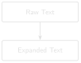

# Cleaning Operational Text {#sec-chapter-02}

::: {.content-visible when-format="html"}
::: {.pipeline-diagram}
{.diagram-light width="150"}
{.diagram-dark width="150"}
:::
:::

::: {.content-visible when-format="pdf"}
{width="150"}
:::

::: {.chapter-status}
Progress `██░░░░░░░░░░` **2 / 12** &nbsp;·&nbsp; **Estimated time:** 30–45 min &nbsp;·&nbsp; **Difficulty:** 🟢 Beginner
:::

## Learning objectives

By the end of this chapter, you will be able to:

- Explain why oilfield shorthand breaks naive text search and NLP.
- Build a dictionary-based abbreviation expander that respects word
  boundaries so it doesn't corrupt unrelated text.
- Apply the expander across every `.txt` file produced in Chapter 1.

## Operational Problem

Mike, the completions engineer, wants next chapter's search tool to
answer: *"Show me every report that mentions the bottom hole assembly."*
Will it find
report #38? Open the `.txt` file you extracted from it in Chapter 1 and
check: the report never once writes "bottom hole assembly." It writes
`BHA` — twenty-one times. A search tool that only knows the literal words
you typed will come back empty, on a report that was exactly the one you
needed.

## Why keyword search fails

Question: *"Show me every report that mentions the bottom hole
assembly."*

Keyword search for "bottom hole assembly" finds nothing in report #38,
because the report never uses that phrase. Instead it says `BHA` — the
same equipment, different word. A computer matching text literally has
no way to know these mean the same thing. Report #38 also talks about
`WOB`, `MWD`, `SPP`, and a dozen other abbreviations a keyword search
would need to be told about, one by one, before it could ever find them.

Before we can search, summarise, or hand this text to a language model,
we need to expand it into language that means the same thing to a human
and to a machine. That's the whole job of this chapter.

## Example DDR extract

::: {.callout-note title="Real excerpt — report #38, showing both patterns"}
```
PJSM, pre job safety meeting.                     <- self-expanded by source
...
Pick up Curve assembly 2, BHA 21, Reed Hycalog     <- BHA never expanded
SKC613M-01C Trip in hole to 5,200'
...
WOB 20 TO 35k, Rotary 50, Torque 6,500, SPP        <- WOB, SPP never expanded
3200-3400 GPM 560, DIFF 200-300psi
```
:::

## Theory

An abbreviation expander is just a dictionary lookup — `{"BHA": "bottom
hole assembly", "WOB": "weight on bit", ...}` — but two details make or
break it:

1. **Word boundaries.** `str.replace("MD", ...)` will happily mangle a
   word that merely *contains* "MD" as a substring. Match on whole words
   using regex `\b...\b`, not raw substring replacement.
2. **Case.** DDRs mix cases inconsistently — this archive's headers are
   often all-caps while narrative text is mixed-case — so expansion needs
   to be case-insensitive without forcing the rest of the sentence to
   change case.

::: {.callout-tip title="Engineering Translation: Dictionary"}
A Python **dictionary** is an equipment lookup table: you give it a tag
(`"BHA"`) and it gives you back what that tag means
(`"bottom hole assembly"`) — the same way a lookup table on the rig floor
maps a short code stamped on a piece of equipment to its full
specification.
:::

This is deliberately not a machine-learning problem. A few dozen
well-chosen abbreviations, expanded correctly, solve most of the
readability problem — and unlike a model, a dictionary is auditable: you
can list every expansion it will ever make.

```
raw text
   ↓
for each (abbreviation, expansion) in dictionary:
   ↓
  build pattern: \b + abbreviation + \b   (case-insensitive)
   ↓
  substitute every match with the expansion
   ↓
expanded text
```

## Implementation

### Step 1: build the lookup table

## What problem are we solving?

Give the computer the same knowledge a drilling engineer already carries
in their head: what each abbreviation stands for.

## Inputs

- A hand-built list of oilfield abbreviations and their full-text
  expansions, drawn from what actually appears in this archive.

## Expected Output

A Python dictionary — no output printed yet, just a lookup table in
memory, ready for the next step to use.

```{python}
#| eval: false
# code/chapter_02/expand_abbreviations.py
ABBREVIATIONS = {
    "BHA": "bottom hole assembly",
    "WOB": "weight on bit",
    "RPM": "revolutions per minute",
    "ROP": "rate of penetration",
    "MD": "measured depth",
    "TVD": "true vertical depth",
    "SPP": "stand pipe pressure",
    "GPM": "gallons per minute",
    "DLS": "dogleg severity",
    "MWD": "measurement while drilling",
    "NMDC": "non-magnetic drill collar",
    "UBHO": "universal bottom hole orientation sub",
    "NPT": "non-productive time",
    "ECD": "equivalent circulating density",
    "MW": "mud weight",
    "DFS": "days from spud",
    "DOL": "days on location",
    "PDC": "polycrystalline diamond compact",
}
```

## What just happened?

You wrote down, once, what every abbreviation in this archive means. This
list is the entire "knowledge" the expander needs — no training, no
model, just a table you can read top to bottom and check by eye.

### Step 2: expand every abbreviation safely

## What problem are we solving?

Turn `BHA` into `bottom hole assembly` everywhere it appears as its own
word — without also mangling words that merely happen to contain those
same letters.

## Inputs

- Raw report text (a Python string).
- The `ABBREVIATIONS` lookup table from Step 1.

## Expected Output

The same text, with every whole-word abbreviation replaced by its
expansion — for example, `Pick up Curve assembly 2, BHA 21` becomes
`Pick up Curve assembly 2, bottom hole assembly 21`.

```{python}
#| eval: false
import re

def expand_text(text: str, abbreviations: dict[str, str] = ABBREVIATIONS) -> str:
    for abbr, expansion in abbreviations.items():
        pattern = r"\b" + re.escape(abbr) + r"\b"
        text = re.sub(pattern, expansion, text, flags=re.IGNORECASE)
    return text
```

## What just happened?

For every entry in the lookup table, this checks the text for that exact
word — not just those letters anywhere, but that whole word on its own —
and swaps in the full expansion, regardless of whether it was typed in
capitals or lowercase.

::: {.callout-tip title="Engineering Translation: Word boundary matching"}
`\b...\b` is a stricter kind of find-and-replace: instead of "contains
these letters anywhere," it means "matches this exact word, with a space
or punctuation on either side." That's the difference between correctly
expanding the word `MD` and accidentally mangling it inside an unrelated
word that merely contains those two letters.
:::

### Step 3: run it across the whole archive

## What problem are we solving?

Apply the expander to every report at once, not just one file at a time.

## Inputs

- The folder of `.txt` files Chapter 1 produced: `datasets/ddr_text/`.

## Expected Output

A new folder, `datasets/ddr_text_expanded/`, with one expanded `.txt`
file per input file, same filenames.

```bash
python code/chapter_02/expand_abbreviations.py \
    --in-dir datasets/ddr_text --out-dir datasets/ddr_text_expanded
```

## What just happened?

The script read every `.txt` file Chapter 1 produced, ran each one through
`expand_text`, and saved the result under the same filename in a new
folder — so you can always find the expanded version of a report by
matching its name against the original.

## Production Reality

This chapter's dictionary covers the abbreviations that actually appear
in this archive — because it's all one well, produced by one operator's
reporting software. A larger, multi-well or multi-operator archive is
rarely that uniform. Expect:

- different operators abbreviating the same equipment differently
- typos and inconsistent spacing (`BHA`, `B.H.A.`, `B H A`)
- unit mismatches hiding behind the same abbreviation (`MW` as mud weight
  on one report, something else entirely on another)
- abbreviations this dictionary has simply never seen before

None of that appears in Utah FORGE's reports, which is exactly why this
is the right place to learn the technique before facing a messier
archive.

## Practical exercise

🟢 **Beginner**

**Try it yourself:** Help Mike get his answer — run the expander against
`FORGE-16A-78-32_Drilling_038_2020-11-26.txt`.

**You'll know it worked when:** `Pick up Curve assembly 2, BHA 21` becomes
`Pick up Curve assembly 2, bottom hole assembly 21`, and no unrelated
word (check the `MD`/`TVD` survey table carefully — short abbreviations
are the ones most likely to collide with real words) gets corrupted.

## Field notes

::: {.callout-warning title="🔧 Field notes: the source already expands some abbreviations — but not the ones that matter"}
**Action:** search every report for the literal string `PJSM`.

**Result:** it appears in six of the ten sample reports (not logged on
rig-up or trip days when no fresh crew safety meeting was held) — but
every single time it does appear, it's immediately followed by its own
expansion, written by the source software itself: `PJSM, pre job safety
meeting`.

**Why:** this archive's report-generation software (WellEz) evidently has
a template that spells "pre job safety meeting" out in full every time,
right after the abbreviation. But run the same check against `BHA`,
`WOB`, `MWD`, or `SPP` — the terms that actually carry operational
meaning in the time breakdown — and none of them ever get that
treatment, anywhere in the archive.

**Lesson:** don't assume a real archive is consistently either
abbreviated or expanded. This one is both, unevenly, by accident of
whatever template a report-writing tool happened to use for one specific
phrase. An automated expander has to cover every term regardless — you
can't rely on the source to have already done the job for the ones that
matter.
:::

## Challenge exercise

🟠 **Intermediate**

**Challenge:** Extend `ABBREVIATIONS` using [Appendix
B](../appendix/appendix_b_oilfield_glossary.qmd), and handle the mud-table
abbreviations (`FV`, `WL`, `PV`, `YP`, `CL`) — notice how short these are,
and think carefully about whether blindly expanding a two-letter token
like `PV` is actually safe against this archive's real text, or whether
it needs a narrower match context. A reference solution is in
`code/chapter_02/challenge/`.

## Key takeaways

- Word-boundary regex, not substring replacement, is the difference
  between a correct expander and a silently broken one.
- Real archives are inconsistent by nature — the same report can spell
  one abbreviation out in full while never expanding another. Don't
  assume the source data will document itself.
- A transparent dictionary beats an opaque model here: every expansion is
  inspectable and testable.
- Cleaning text is not optional groundwork — it's what makes every later
  chapter's search and retrieval actually work.

## Repository files

| File | Purpose |
|---|---|
| `code/chapter_02/expand_abbreviations.py` | Word-boundary abbreviation expander |
| `datasets/ddr_text_expanded/` | Expanded output from Chapter 1's extracted text |
| `notebooks/chapter_02_explore.ipynb` | Interactive companion notebook |

::: {.callout-caution title="CHECKPOINT — Chapter 2"}
- [x] Explained why oilfield shorthand breaks naive text search
- [x] Built a word-boundary-safe abbreviation dictionary
- [x] Expanded every `.txt` file from Chapter 1 without corrupting unrelated text
:::

::: {.callout-tip .built-box title="✓ WHAT YOU BUILT"}
**`expand_abbreviations.py`** — an abbreviation expansion engine: point it
at Chapter 1's extracted text and it hands back plain-language text, ready
for Chapter 3's search index.
:::

## What can you do now that you couldn't do before?

You can take the raw text Chapter 1 extracted and turn every shorthand
term in it into plain language — so a report that only ever says `BHA`
can now be found by anyone (or anything) searching for "bottom hole
assembly."

## Suggested next step

**Coming up in Chapter 3:** With clean, expanded text in hand, Chapter 3
builds the first tool an engineer would actually reach for: a keyword
search engine that answers "which reports mention losses?" in
milliseconds.
