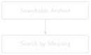
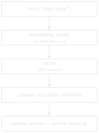

# Semantic Search {#sec-chapter-04}

::: {.content-visible when-format="html"}
::: {.pipeline-diagram}
{.diagram-light width="180"}
{.diagram-dark width="180"}
:::
:::

::: {.content-visible when-format="pdf"}
{width="180" fig-align="center"}
:::

::: {.chapter-status}
Progress `████░░░░░░░░` **4 / 12** &nbsp;·&nbsp; **Estimated time:** 60–75 min &nbsp;·&nbsp; **Difficulty:** 🟠 Intermediate
:::

## Learning objectives

By the end of this chapter, you will be able to:

- Explain, without heavy math, what a text embedding is and why nearby
  vectors mean similar meaning.
- Generate embeddings for a folder of DDR text using
  `sentence-transformers`.
- Retrieve the most semantically similar chunks to a query using cosine
  similarity, without any exact keyword overlap required.
- Recognise that semantic search over whole documents is an improvement,
  not a complete fix — and that granularity is what actually determines
  how well it works.

## Operational Problem

Chapter 3 ended on a real miss: Sarah's query `"stuck pipe"` found report
#38 (the actual incident) but was blind to report #39, which describes
tight hole, high torque, and a decision to pull out of hole — real
continued-risk language, written the very next day — without ever using
the word "stuck." Sarah, reading both reports herself, says "yes,
obviously, day two of the same problem." A keyword search can't see that
at all. Let's find out, honestly, how much of that gap semantic search
actually closes.

## Example DDR extract

::: {.callout-note title="The same query, now by meaning"}
```
Query: "stuck pipe"  (same query Chapter 3 used)

Keyword search (Chapter 3): report #39 not in results at all.

Semantic search, whole-report embeddings (this chapter): report #39
  ranks 5th out of 10 — findable, but not prominent. Report #38 (the
  actual incident) ranks 2nd.
```
:::

## Theory

An **embedding model** converts a piece of text into a fixed-length vector
of numbers — typically a few hundred dimensions — such that texts with
similar meaning end up as vectors that are close together in that space.
You don't need to understand the neural network that produces this vector;
you need to understand what it gives you: a numeric representation of
meaning you can compare with simple arithmetic.

::: {.callout-tip title="Engineering Translation: Vector / embedding"}
Think of an embedding as GPS coordinates for meaning. Instead of latitude
and longitude, it's a few hundred numbers — but the idea is the same: two
sentences with similar meaning end up with "coordinates" close together,
the same way two rigs in the same field end up with similar latitude and
longitude, even if their names have nothing in common.
:::

**Cosine similarity** measures the angle between two vectors — 1.0 for
identical direction, 0 for unrelated, negative for opposite. It's the
standard way to compare embeddings because it ignores vector *length* and
focuses purely on *direction*, which is what carries the meaning here.

::: {.callout-tip title="Engineering Translation: Cosine similarity"}
Cosine similarity is a compass bearing, not a ruler. It asks "which way is
this thing pointing?", not "how big is it?" — so a short sentence and a
long paragraph about the same topic can still score as pointing the same
direction, the same way two surveys can report the same azimuth
regardless of how long each run was.
:::

We use `sentence-transformers` [@reimers2019sbert] with a small, fast
model (`all-MiniLM-L6-v2`) — good enough to prove the concept and small
enough to run on a laptop CPU. Chapter 8 replaces the brute-force search here
with a proper vector database once the corpus grows past what fits
comfortably in memory.

::: {.content-visible when-format="html"}
::: {.pipeline-diagram}
{.diagram-light width="260"}
{.diagram-dark width="260"}
:::
:::

::: {.content-visible when-format="pdf"}
{width="260" fig-align="center"}
:::

## Implementation

### Step 1: load every report's text

## What problem are we solving?

Get every report's text into memory, alongside its filename, so we know
which score belongs to which report later.

## Inputs

- A folder of cleaned report text, e.g. `datasets/ddr_text/`.

## Expected Output

Two matching lists: report filenames, and each report's full text.

```{python}
#| eval: false
# code/chapter_04/semantic_search.py
from pathlib import Path

def load_chunks(text_dir: Path) -> tuple[list[str], list[str]]:
    filenames, texts = [], []
    for path in sorted(text_dir.glob("*.txt")):
        filenames.append(path.name)
        texts.append(path.read_text(encoding="utf-8"))
    return filenames, texts
```

## What just happened?

Nothing about meaning yet — this just reads every text file into memory
and keeps a matching list of filenames, so that whatever score we
calculate next can be traced back to the report it came from.

Note the folder: `datasets/ddr_text/`, Chapter 1's raw extraction — *not*
Chapter 2's `datasets/ddr_text_expanded/`. That's deliberate, and the
Field Notes at the end of this chapter measure exactly why.

### Step 2: convert text into vectors

## What problem are we solving?

Turn each report's text into a numeric representation of its meaning, so
that "similar meaning" can be measured with arithmetic instead of exact
word matching.

## Inputs

- `MODEL_NAME = "all-MiniLM-L6-v2"`, a pre-trained embedding model.
- The list of report texts from Step 1.

## Expected Output

One 384-number vector per report, all packed into a single array.

```{python}
#| eval: false
import numpy as np
from sentence_transformers import SentenceTransformer

MODEL_NAME = "all-MiniLM-L6-v2"

def embed_texts(model: SentenceTransformer, texts: list[str]) -> np.ndarray:
    embeddings = model.encode(texts, normalize_embeddings=True)
    return np.asarray(embeddings)
```

## What just happened?

The model read each report and produced its "GPS coordinates for
meaning" — one vector per report. `normalize_embeddings=True` scales
every vector to the same length, so later we can compare direction only,
which is exactly what cosine similarity needs.

### Step 3: rank reports against a query

## What problem are we solving?

Given a query like "stuck pipe," find which reports are closest in
meaning — not which reports contain those exact words.

## Inputs

- The query string.
- The array of report vectors from Step 2.

## Expected Output

A ranked list of `(filename, score)` pairs, highest similarity first.

```{python}
#| eval: false
def search(model: SentenceTransformer, query: str, filenames: list[str],
           embeddings: np.ndarray, top_k: int = 3) -> list[tuple[str, float]]:
    query_vec = model.encode([query], normalize_embeddings=True)[0]
    scores = embeddings @ query_vec  # cosine similarity, since vectors are normalized
    top_indices = np.argsort(-scores)[:top_k]
    return [(filenames[i], float(scores[i])) for i in top_indices]
```

## What just happened?

The query got turned into its own vector, then compared against every
report's vector at once. Because every vector was normalized to the same
length in Step 2, one matrix multiplication (`embeddings @ query_vec`)
gives back the cosine similarity for every report simultaneously —
that's the "arithmetic" that replaces exact word matching.

Run this against all ten sample reports with `query="stuck pipe"` and
`top_k=10` (the whole ranking, not just the top few), and you get the
real numbers behind the callout above:

```
1. 0.2416  Completion_003_2021-01-06
2. 0.1978  Drilling_038_2020-11-26   <- the actual stuck-pipe day
3. 0.1713  Drilling_049_2020-12-07
4. 0.1657  Drilling_003_2020-10-22
5. 0.1498  Drilling_039_2020-11-27   <- tight hole / high torque, findable now
6. 0.1406  Drilling_048_2020-12-06
7. 0.1342  Drilling_019_2020-11-07
8. 0.1326  Drilling_037_2020-11-25
9. 0.1319  Drilling_050_2020-12-08
10. 0.1169 Drilling_036_2020-11-24
```

Report #39 went from *absent* (Chapter 3) to *rank 5 of 10* — a real
improvement, worth having. But it's not a clean win: the scores are
bunched close together (0.12–0.24), and a busy engineer scanning only the
top 2 or 3 results would still miss it.

## Production Reality

This chapter runs the embedding model locally, on a laptop CPU, against
ten short reports. Real deployments hit constraints this setup never
sees:

- some teams call a hosted embedding API instead of running a model
  locally — which means sending report text, possibly confidential well
  data, to a third party. That's a data-governance conversation, not just
  a technical choice, and it's worth having before it's a surprise.
- embeddings from two different model versions aren't comparable — if you
  re-embed your archive with a newer model, old and new vectors can't be
  compared against each other, and everything needs re-embedding together.
- embedding a full multi-well archive (thousands of reports, not ten)
  takes real time and, for hosted APIs, real money — a cost that scales
  with archive size, not query volume.
- a similarity score like 0.24 is only meaningful *relative to other
  scores in the same search* — it is not "24% similar" in any absolute
  sense, and comparing scores across different queries or models is not
  valid.

## Field notes

::: {.callout-warning title="🔧 Field notes: why whole-document embeddings are noisy"}
**Query:** `"stuck pipe"`, same as above.

**Result:** report #39 ranks 5th of 10 when you embed each *entire
report* as one vector — an improvement over keyword search's zero, but
not a clean fix.

**Why:** each report is one page, but that page holds seven distinct data
tables (casing, mud, drill bits, pumps, BHA, survey data, consumables)
plus the narrative time breakdown. Embedding the whole thing blends a
handful of sentences of relevant narrative with a few hundred words of
numeric table content. The relevant signal — "Work tight hole... high
torque... pull out of hole" — is a small fraction of what actually goes
into the vector.

Isolate just the narrative lines instead of the whole report, and the
picture changes — though not as cleanly as you might hope:

```
0.6244  report #38 — "Pipe free"
0.3359  report #38 — "During the slide lost tool face and became
                       assembly became stuck"
0.2402  report #39 — "Due to high torque decision to pull out of hole"
0.2331  report #39 — "Hole drag from 6,050' to 5,901' no issues"
0.2206  report #49 — "Attempted multiple times to set packers"
0.2043  report #36 — "Trip out of hole with BHA #17 core assembly."
        (genuinely unrelated coring operation)
0.2008  report #39 — "Work tight hole at 6,526'."
```

The two lines that directly describe the stuck-pipe event itself separate
clearly from everything else (0.62 and 0.34 vs. everything else under
0.25) — something whole-document embedding couldn't show at all. But
below that, there's no clean cutoff: report #39's own `"hole drag...no
issues"` line — a routine trip note, not part of the incident — scores
almost as high as its `"high torque"` line (0.23 vs. 0.24), while report
#36's genuinely unrelated coring line (0.20) lands in the same narrow
band as report #39's own `"tight hole"` line (0.20), the actual precursor
to the stuck-pipe event. Shared drilling vocabulary ("hole," "trip,"
"torque") pulls topically-similar-but-irrelevant lines close to
genuinely relevant ones once you're past the two standout lines.

**Lesson:** semantic search doesn't fail because the *technique* is wrong
— it fails here because the *unit of retrieval* is too coarse. Line-level
granularity narrows the field dramatically, but it doesn't hand you a
clean similarity threshold to filter on — the middle of the ranked list
still mixes relevant and irrelevant lines together. This is exactly the
problem Chapter 7's chunking (and later, reranking) works on, and it's
worth remembering the next time a semantic search "isn't working": check
what's actually inside each embedded vector before blaming the model —
but don't expect a single score cutoff to solve it either.
:::

::: {.callout-warning title="🔧 Field notes: does expanding abbreviations actually help semantic search?"}
**Action:** embed the ten reports twice — once from Chapter 1's raw text
(`datasets/ddr_text/`), once from Chapter 2's expanded text
(`datasets/ddr_text_expanded/`) — and compare the same two queries at
`top_k=3`.

**Result:**

```
Query "bottom hole assembly":
  raw text:      report #38 ranks 2nd  (0.302)
  expanded text: report #38 ranks 1st  (0.372)   <- BHA now reads in full

Query "stuck pipe":
  raw text:      report #38 ranks 2nd
  expanded text: report #38 ranks 2nd            <- essentially unchanged
```

**Why:** expansion only helps a query whose wording matches a term you
actually expanded. `"bottom hole assembly"` improves because the reports
now literally contain that phrase instead of only `BHA` — so report #38
climbs from 2nd to 1st. `"stuck pipe"` doesn't move, because "stuck" was
never an abbreviation to begin with.

**Lesson:** expansion earns its keep for keyword search (Chapter 3, which
matches literal words), but its benefit to *semantic* search is real yet
narrow — confined to queries that happen to use a term you expanded. That
narrowness is why this book feeds the raw text to the embedding model from
here on, rather than adding a whole pipeline stage the semantic path
barely uses. Keyword search keeps using the expanded text; embeddings use
the raw. Neither choice is arbitrary, and now you've measured why.
:::

## Practical exercise

🟢 **Beginner**

**Try it yourself:** Embed all ten sample DDRs and run
`search(model, "stuck pipe", filenames, embeddings, top_k=10)`.

**You'll know it worked when:** `FORGE-16A-78-32_Drilling_039_2020-11-27.txt`
appears somewhere in your ranked results — unlike Chapter 3, where it
didn't appear at all — even if it isn't near the top.

## Challenge exercise

🟠 **Intermediate**

**Challenge:** Reproduce the Field Notes line-level result yourself.
Manually pull three lines of text, verbatim from the source reports —
report #39's `"Due to high torque decision to pull out of hole"`, report
#39's `"Hole drag from 6,050' to 5,901' no issues"`, and report #36's
`"Trip out of hole with BHA #17 core assembly."` (a genuinely unrelated
line) — embed just those three strings, and confirm the high-torque line
scores highest against `"stuck pipe"`, report #39's own hole-drag line
scores close behind it, and the genuinely unrelated line trails both by
a real margin. A reference solution is in `code/chapter_04/challenge/`.

## Key takeaways

- Embeddings represent meaning as geometry: similar meaning, nearby
  vectors.
- Cosine similarity is the standard comparison because it isolates
  direction (meaning) from magnitude.
- Semantic search over whole documents is a real improvement on keyword
  search — report #39 goes from unfindable to rank 5 of 10 — but "an
  improvement" and "solved" are different claims. Don't oversell it.
- Granularity is often the actual lever, not the embedding model. The
  same query, same model, same text — just isolated to individual
  narrative lines instead of a whole noisy report — turns a middling
  rank-5 result into a clear, checkable win.
- Brute-force cosine search (a matrix multiply) is entirely adequate at
  ten documents. It stops being adequate well before you reach the full
  76-report archive's scale — that's Chapter 8's problem to solve.

## Repository files

| File | Purpose |
|---|---|
| `code/chapter_04/semantic_search.py` | Embedding generation and brute-force cosine search |
| `notebooks/chapter_04_explore.ipynb` | Interactive companion notebook |

::: {.callout-caution title="CHECKPOINT — Chapter 4"}
- [x] Explained what a text embedding is without needing the underlying math
- [x] Generated embeddings for a folder of DDR text
- [x] Ranked reports by semantic similarity to a query using cosine similarity
- [x] Diagnosed granularity, not the model, as the real bottleneck
:::

::: {.callout-tip .built-box title="✓ WHAT YOU BUILT"}
**`semantic_search.py`** — a brute-force semantic search engine: embed a
folder of reports once, then rank any query against them by meaning, not
spelling.
:::

## What can you do now that you couldn't do before?

You can retrieve relevant report passages by meaning instead of exact
wording — finding report #39's continued-risk language even though it
never says "stuck" — and you know precisely why the result isn't perfect
yet: granularity, not the model, is the real bottleneck.

## Suggested next step

**Coming up in Chapter 5:** You can now retrieve relevant passages by
meaning, and you've learned the honest limits of doing it at
whole-document granularity. Chapter 5 turns retrieval into an answer:
given a question, retrieve the right evidence, and generate a response
that cites exactly where each claim came from. Chapter 7 comes back to
fix the granularity problem directly.
