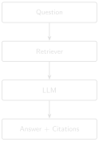
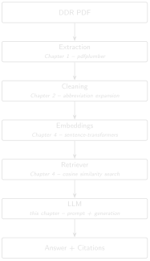

# First RAG System {#sec-chapter-05}

::: {.content-visible when-format="html"}
::: {.pipeline-diagram}
{.diagram-light width="180"}
{.diagram-dark width="180"}
:::
:::

::: {.content-visible when-format="pdf"}
{width="180" fig-align="center"}
:::

::: {.chapter-status}
Progress `█████░░░░░░░░` **5 / 13** &nbsp;·&nbsp; **Estimated time:** 60–90 min &nbsp;·&nbsp; **Difficulty:** 🟠 Intermediate
:::

## Learning objectives

By the end of this chapter, you will be able to:

- Explain retrieval-augmented generation (RAG) as two separate,
  inspectable steps: retrieve, then generate.
- Assemble retrieved chunks into a prompt that forces a language model to
  answer only from the evidence it's given.
- Generate that answer with a real local model (via Ollama) and return it
  with an explicit evidence list — the source reports and excerpts —
  rather than an unsupported paragraph.

## Operational Problem

Retrieval (Chapter 4) gets you the right passages. What Mike, the
completions engineer, actually wants is an answer: *"What led to the
fishing operation on report #50?"* — not two ranked text chunks he has
to read and synthesise himself. But a generated answer that isn't
traceable back
to specific reports is worse than no answer at all in an engineering
context, because it invites misplaced trust. This chapter builds the
smallest system that does both: synthesise an answer, and show exactly
where every part of it came from.

## Example DDR extract

::: {.callout-note title="Target interaction, grounded in two real, adjacent reports"}
```
Question: What led to the fishing operation on report #50?

Answer: On report #49 (2020-12-07), the crew attempted multiple times
to set packers on BHA #32, but pressure readings showed the ball did
not seat and the packers failed to set. They tripped out with the
packer assembly and picked up a fishing BHA (#33) that same day. On
report #50 (2020-12-08), that fishing run milled up lost pieces of bit.

Evidence:
  FORGE-16A-78-32_Drilling_049_2020-12-07.pdf
  FORGE-16A-78-32_Drilling_050_2020-12-08.pdf
```
:::

Both claims here are directly quoted from real report text — nothing in
this answer was inferred beyond what the two reports state. This is the
*target*. Keep reading — the practical exercise below checks whether the
simple system this chapter builds actually reaches it.

## Theory

**RAG (retrieval-augmented generation)** [@lewis2020rag] is exactly the
two chapters you just built, chained together: retrieve relevant evidence
(Chapter 4), then hand that evidence to a language model and ask it to
answer *using only that evidence*. (Chapter 4's embedding model and this
chapter's language model are easy to blur together, since both get
called "the model" — but one retrieves, the other writes; that pair,
chained together, is what RAG means in practice.) The model is not
answering from what it memorised during training — it's answering from
the specific passages you retrieved, which is what makes citation
possible at all.

::: {.callout-tip title="Engineering Translation: LLM"}
An **LLM** (large language model) is like a very well-read new hire: it
has absorbed an enormous amount of general drilling and engineering
writing, so it writes fluently and knows the vocabulary — but it has
never seen *your* wells or *your* reports. Left to its own memory, it will
guess. RAG is how you make sure it answers from the actual report in
front of it, not from a guess dressed up in confident language.
:::

::: {.callout-tip title="Engineering Translation: Prompt"}
A **prompt** is the instructions-plus-evidence packet you hand that new
hire before asking them to write anything — the equivalent of handing
them the specific job's DDRs and a clear brief, instead of just asking
"what usually happens in a fishing job?" and hoping they don't improvise.
:::

The critical design decision is the prompt: instruct the model explicitly
to answer only from the provided context, and to cite which source each
part of the answer came from. This doesn't make hallucination — a model
confidently stating something false — impossible; Chapter 10 covers
stronger mitigations. But it is the foundation everything else builds on.

Here's the complete pipeline you've actually built, chapter by chapter —
every arrow below is real, working code you've already written:

::: {.content-visible when-format="html"}
::: {.pipeline-diagram}
{.diagram-light width="280"}
{.diagram-dark width="280"}
:::
:::

::: {.content-visible when-format="pdf"}
{width="280" fig-align="center"}
:::

This is deliberately the simplest version of this pipeline that could
possibly work — brute-force search, whole-document embeddings, no
reranking, no traceability guardrails beyond a citation list. Part II
rebuilds nearly every arrow in this diagram to survive a real, full-scale
archive.

## Implementation

### Step 1: write the instructions the model must follow

**What problem are we solving?**

Make sure the model answers from the evidence you hand it, not from
whatever it remembers from training — and make sure it tells you which
report each part of the answer came from.

**Inputs**

- None yet — this is a fixed template, filled in for each question later.

**Expected Output**

A reusable prompt template with two blanks: the evidence, and the
question.

```{python}
#| eval: false
# code/chapter_05/first_rag.py
PROMPT_TEMPLATE = """Answer the question using ONLY the evidence below.
If the evidence doesn't contain the answer, say so — do not guess.
Cite which report each part of your answer comes from.

Evidence:
{evidence}

Question: {question}
Answer:"""
```

**What just happened?**

This is the "brief" you hand the model every single time: answer only
from what's provided, admit it when the evidence doesn't cover the
question, and always say which report backs each claim. Everything else
in this chapter exists to fill in `{evidence}` and `{question}` correctly.

### Step 2: assemble the evidence into that template

**What problem are we solving?**

Take the reports Chapter 4's retriever found and package them, labelled
by filename, into the prompt template's `{evidence}` blank.

**Inputs**

- A question string.
- The retrieved `(filename, score)` pairs from Chapter 4's `search`.
- The full filename and text lists from Chapter 4's `load_chunks`.

**Expected Output**

One complete prompt string, evidence labelled by source filename, ready
to send to a model.

```{python}
#| eval: false
from pathlib import Path

from semantic_search import embed_texts, load_chunks, search  # from Chapter 4

def build_prompt(question: str, retrieved: list[tuple[str, float]],
                  filenames: list[str], texts: list[str]) -> str:
    evidence_blocks = []
    for filename, _score in retrieved:
        text = texts[filenames.index(filename)]
        evidence_blocks.append(f"[{filename}]\n{text}")
    return PROMPT_TEMPLATE.format(
        evidence="\n\n".join(evidence_blocks),
        question=question,
    )
```

**What just happened?**

For every report Chapter 4's retriever returned, this tags its full text
with its own filename in square brackets, then stitches all of them
together into the `{evidence}` section of the prompt. Every fact the
model can possibly cite is now labelled with exactly which report it came
from.

### Step 3: retrieve, then generate, then report the sources

**What problem are we solving?**

Chain retrieval and generation into one function: given a question, find
the evidence, ask the model to answer from it, and hand back both the
answer and the exact list of reports it was allowed to use.

**Inputs**

- A question string.
- The embedding model, filenames, texts, and embeddings from Chapter 4.
- `llm_call`: any function that takes a prompt string and returns the
  model's answer.

**Expected Output**

A tuple: the generated answer text, and the list of report filenames
that were actually retrieved and shown to the model.

```{python}
#| eval: false
def answer_question(question: str, model, filenames, texts, embeddings,
                     llm_call) -> tuple[str, list[str]]:
    retrieved = search(model, question, filenames, embeddings, top_k=3)
    prompt = build_prompt(question, retrieved, filenames, texts)
    answer_text = llm_call(prompt)  # plug in your LLM of choice
    evidence = [filename for filename, _score in retrieved]
    return answer_text, evidence
```

**What just happened?**

This is the whole system end to end: retrieve the top matching reports,
build a prompt from them, generate an answer, and return that answer
alongside the exact evidence list it was built from — so you (or an
engineer reviewing the answer) can always check the citation against the
real reports, rather than taking the model's word for it.

`llm_call` is intentionally a plain function argument, not **hardcoded**
(wired permanently to one specific service): plug in a local model, an
API-based model, or — while you're
first testing the retrieval and prompt logic — a stub that just echoes the
evidence back, so you can verify the pipeline end to end before spending a
single API call.

### Step 4: plug in a real local model

The stub proved the plumbing. Now generate for real — locally, so no
report text ever leaves your machine. [Ollama](https://ollama.com) runs a
small open model on your own hardware.

**Install Ollama** (one-time setup):

- **macOS / Windows:** download the installer from
  [ollama.com/download](https://ollama.com/download) and run it like any
  other application.
- **Linux:** `curl -fsSL https://ollama.com/install.sh | sh`

Confirm it installed:

```bash
ollama --version
```

**Expected output:** something like `ollama version 0.x.x`. If the
command isn't recognised, close and reopen your terminal — installers
update your system PATH, which a terminal window already open won't see
until it restarts.

**Pull a model and start the server:**

```bash
ollama pull qwen2.5:7b-instruct
ollama serve            # leave this running in its own terminal
```

::: {.callout-note title="What this downloads, and how big it is"}
`ollama pull qwen2.5:7b-instruct` downloads roughly 4–5 GB — a few
minutes on a typical connection, longer on a slow one. That's on top of
this book's stated 5 GB minimum free disk space, so budget closer to
10 GB total if you're running near the minimum. Running the model
comfortably also wants RAM headroom beyond your browser, editor, and
everything else already open — 16 GB total is noticeably more
comfortable than the book's 8 GB minimum once a local model joins the
mix.
:::

`qwen2.5:7b-instruct` is a small, capable default, but nothing here is
tied to it — pass any model you've pulled to `ollama_llm_call(model=...)`.
Pick whatever runs comfortably on your hardware: `llama3.1:8b` or
`mistral` are similar in size, `qwen2.5:14b` is stronger if you have the
memory for it, and swapping the one HTTP call for a hosted API's would let
you point at a cloud model instead. The retrieval and prompt work above
doesn't change either way — only which model reads the evidence.

`ollama_llm_call` talks to that local server over plain HTTP — standard
library only, no extra package to install, and a clear message instead of
a crash if Ollama isn't running:

```{python}
#| eval: false
import json
import urllib.error
import urllib.request

def ollama_llm_call(prompt: str, model: str = "qwen2.5:7b-instruct") -> str:
    payload = json.dumps({"model": model, "prompt": prompt, "stream": False}).encode()
    request = urllib.request.Request("http://localhost:11434/api/generate", data=payload,
                                     headers={"Content-Type": "application/json"})
    try:
        with urllib.request.urlopen(request, timeout=120) as response:
            return json.loads(response.read())["response"].strip()
    except (urllib.error.URLError, OSError) as error:
        return f"[Ollama not reachable: {error}. See setup above; retrieval still ran.]"
```

Run the whole system against the single best-matching report:

```bash
python code/chapter_05/first_rag.py "What led to the packers failing to set?"
```

::: {.callout-note title="One real run — qwen2.5:7b-instruct, top_k=1 (your wording will differ)"}
```
Question: What led to the packers failing to set?

Answer:
According to the report, pressures indicated that the ball did not seat
and the packers did not set during an attempt to set packers multiple
times.

Reference:
[FORGE-16A-78-32_Drilling_049_2020-12-07.txt] Page 15: "Production
Drilling Other Pressures indicated that ball did not seat and packers
did not set."

Sources:
  FORGE-16A-78-32_Drilling_049_2020-12-07.txt
    "--- Page 1 --- RPT DATE:12/07/2020 DAILY DRILLING REPORT RPT NUM.:49
     ... WELL NAME:FORGE 16A [78]-32 ..."
```
:::

That's a real RAG answer: a plain-English cause, grounded in report #49's
own words, with the source report named and an excerpt you can open and
check. **Your exact wording will differ** — LLM output isn't
**deterministic**: the same prompt can produce a differently worded
answer each time you run it (the Production Reality note below says
why) — but the grounded fact, the ball that didn't seat, comes back
every time, because it's sitting in the evidence the model was handed.

Two honest limits are already visible in that single run:

- **Evidence width matters.** This ran at `top_k=1` — the one closest
  report. Widen it to `top_k=3` and the model is handed three full pages
  of tables at once; in testing it lost the packer line in the noise and
  answered "the report doesn't mention it." That isn't the model being
  dim — it's the whole-document granularity problem from Chapter 4,
  biting generation now instead of retrieval. Chapter 7's chunking is
  what fixes it.
- **The model can still invent a citation.** Notice the answer cites
  "Page 15." These reports are a single page — there is no page 15. The
  *fact* is grounded; the *page number* is fabricated. A prompt asking
  for citations gets citation-shaped text, not guaranteed-correct
  citations. Chapter 10 wires the real page in from metadata so the model
  can't make one up.

## Production Reality

This chapter's prompt says "answer only from the evidence" — but an
instruction in a prompt is a strong nudge, not a guarantee. Real systems
have to plan around what happens when that nudge isn't enough:

- models don't follow instructions perfectly every time — occasionally
  one will still answer from general knowledge instead of the evidence,
  or blend the two without saying so
- the same question, asked twice, can produce two differently worded
  answers — LLM output isn't fully deterministic, which matters when
  someone asks "why did it say something different yesterday?"
- long evidence sections eventually hit the model's context window — the
  limit on how much text it can read at once
  — a real archive's retrieved chunks can't just grow without bound
- every call to a hosted LLM API costs money and takes time; a system
  answering hundreds of engineering questions a day needs a cost and
  latency budget, not just a working prompt

None of this means RAG doesn't work — it means "answer only from
evidence" is a design goal you build toward, not a switch you flip.
Chapter 10 covers the guardrails that close this gap further.

## Practical exercise

🟢 **Beginner**

**Try it yourself:** Wire up `answer_question` with a stub `llm_call` that
simply returns the evidence text, run it for "What led to the fishing
operation on report #50?" with `top_k=3`, and print the evidence list.

**You'll know it worked when:** you can see exactly which three reports
came back — and, before reading further, decide for yourself whether
that list actually contains what the target answer above needs.

## Field notes

::: {.callout-warning title="🔧 Field notes: the report the question is about isn't in the evidence"}
**Query:** `"What led to the fishing operation on report #50?"`, `top_k=3`.

**Result:** retrieval returns report #49 (rank 1) plus two other reports
— but **not report #50**, the report the question is literally about.
The full ranking:

```
1. 0.4540  Drilling_049_2020-12-07   <- packers fail (correctly retrieved)
2. 0.3639  Drilling_038_2020-11-26
3. 0.3469  Drilling_003_2020-10-22
...
7. 0.3190  Drilling_050_2020-12-08   <- the fishing report itself
```

**Why:** report #50's own text — bit-mill fishing narrative buried among
casing tables, mud tables, and a full BHA component list — is, at
whole-document granularity, more similar to *several other reports'*
tables than it is to a question about fishing. This is the same
granularity problem Chapter 4 already flagged; here it has a sharper
consequence.

**Lesson:** this is exactly the failure mode this chapter's own Key
Takeaways warn about — and it's a dangerous one specifically *because*
the question names "report #50" directly. A careless `llm_call`
implementation could echo that report number back in its answer without
ever having actually retrieved report #50's content, producing a
citation-shaped sentence that *looks* grounded and isn't. Always check
what's actually in the evidence list — not what the question happens to
mention — before trusting an answer. Chapter 7's chunking and Chapter 9's
hybrid retrieval are what actually close this gap; Part I's simple
system doesn't, and pretending otherwise would defeat the entire point
of this book.
:::

## Challenge exercise

🔴 **Advanced**

**Challenge:** Connect a real LLM (local via `transformers`/`ollama`, or a
hosted API) as `llm_call`, and add a check that rejects the answer if it
mentions a report filename that wasn't in the retrieved evidence list — a
first, crude hallucination guard. Then ask it a question the ten-report
sample archive genuinely can't answer (e.g. "what happened on report
#100?") and confirm it says so rather than inventing an answer. A
reference solution is in `code/chapter_05/challenge/`.

## Key takeaways

- RAG is retrieval, then generation — two separate, individually
  debuggable steps, not one opaque black box.
- If retrieval is wrong, generation cannot save you — always verify the
  evidence list before trusting the generated answer.
- A prompt that instructs "answer only from evidence, cite sources" is
  necessary but not sufficient for trustworthy answers. Part II builds the
  guardrails that make it sufficient.

::: {.callout-tip title="A habit worth starting now: keep a tiny answer key"}
Before you start tuning retrieval settings in Part II — chunk sizes
(Chapter 7), fusion weights (Chapter 9) — write down three questions you
already know the answer to, like *"which report shows packers failing to
set?"* → report #49, and note which report each one *should* return.
That short list is the seed of Chapter 11's evaluation set, and it turns
"did that change actually help?" into something you can check, instead of
a feeling.
:::

## Repository files

| File | Purpose |
|---|---|
| `code/chapter_05/first_rag.py` | Prompt assembly and evidence-tracked question answering |
| `notebooks/chapter_05_explore.ipynb` | Interactive companion notebook |

::: {.callout-caution title="CHECKPOINT — Chapter 5"}
- [x] Explained RAG as two separate, inspectable steps: retrieve, then generate
- [x] Assembled retrieved evidence into a prompt that forces answers from that evidence only
- [x] Generated a real answer with a local model (Ollama), returned with its source reports and excerpts
- [x] Caught a real case where the cited report wasn't actually in the evidence
:::

::: {.callout-tip .built-box title="✓ WHAT YOU BUILT"}
**`first_rag.py`** — a working RAG *prototype*: ask it a question in plain
English, and it retrieves evidence, generates an answer with a local
model, and hands back the source reports and excerpts that answer is
traceable to. This is Part I's capstone artifact — and the known limits
you just saw in this chapter (evidence width, fabricated page numbers)
are exactly what Part II hardens.
:::

::: {.callout-note title="Try it in the browser: the companion app"}
The optional [DDR RAG Companion App](../app/README.md) (`book/app/`) wraps
this same retrieve-then-generate-then-cite flow in a small Streamlit
screen. Run `streamlit run book/app/streamlit_app.py`, pick a question,
and see the evidence cards, the local-model answer, and a "Why this
answer?" panel side by side. It reuses this chapter's code (plus Chapter
9's hybrid retrieval) — nothing new to learn, just the payoff on one
screen.
:::

## What can you do now that you couldn't do before?

You can ask an engineering question in plain English and get back a
generated answer with an explicit, checkable list of exactly which
reports it came from — not just ranked passages you'd still have to read
and synthesise yourself.

## Suggested next step

**Coming up in Chapter 6:** What you've built in Part I works — on ten
clean, digital, hand-picked reports out of the full 76-report Utah FORGE
archive. Part II industrialises this system against the reality of a
full archive: retrieval that has to be both fast and precise across
every report, and answers that have to survive scrutiny from someone who
wasn't in the room when they were generated. Chapter 6 starts with the
first thing that breaks in a typical real-world archive: scanned reports
with no extractable text at all.
