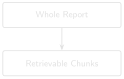

# Chunking That Respects Report Structure {#sec-chapter-07}

::: {.content-visible when-format="html"}
::: {.pipeline-diagram}
{.diagram-light width="180"}
{.diagram-dark width="180"}
:::
:::

::: {.content-visible when-format="pdf"}
{width="180" fig-align="center"}
:::

::: {.chapter-status}
Progress `███████░░░░░░` **7 / 13** &nbsp;·&nbsp; **Estimated time:** 45–60 min &nbsp;·&nbsp; **Difficulty:** 🟠 Intermediate
:::

## Learning objectives

By the end of this chapter, you will be able to:

- Explain why chunk size is measured in tokens, not characters or words.
- Implement token-based chunking with overlap using `tiktoken`.
- Implement segment-aware chunking that breaks at natural report
  boundaries (section headers) instead of at an arbitrary character count.

## Operational Problem

Oumy, the drilling engineer, notices something odd while reviewing
retrieval results: why does the exact sentence she needs keep landing
right on a chunk boundary? Chapters 1–5 embedded each report as a single
unit — fine for a
ten-report sample, unworkable at the full archive's scale. A
single Utah FORGE report already has ten distinct sections (WELL/JOB
INFORMATION, BOP, CASING, MUD, DRILL BITS, PUMPS, BHA, SURVEY DATA,
CONSUMABLES, TIME BREAKDOWN) packed onto one page. Embed too much of that
in one vector and the embedding blurs the casing programme together with
the stuck-pipe narrative, hurting retrieval precision. Split naively at a
fixed character count and you'll cut report #38's stuck-pipe sentence in
half mid-word, right across a chunk boundary — the exact passage you most
need to retrieve becomes the two chunks least likely to score well.

## Example DDR extract

::: {.callout-note title="Why naive splitting fails, using real report #38 text"}
```
Naive fixed-character split, mid-sentence:

Chunk A: "...23:30 04:00 4.5 Drill From 6,360' to 6,507', (147') Total,
          32.6' feet per hour. WOB 20 TO 35k, Rotary 50, Torque 6,500,
          SPP 3200-3400 GPM 560, DIFF 200-300psi During the slide lost
          tool face and became assembly became st"
Chunk B: "uck 04:00 06:00 2.0 Work pipe, circulate lube sweep, work
          tool back in position Pipe free"
```
A query about "what happened when the assembly got stuck" now has its
key evidence split across two separately-scored chunks — neither of
which alone contains the complete sentence.
:::

## Theory

Two ideas, used together, fix this:

1. **Token-based sizing.** Language models and embedding models operate on
   tokens, not characters — and token count is what actually determines
   whether a chunk fits a model's context window and how much a given
   chunk "costs" downstream. Chunking by token count (with a library like
   `tiktoken`) is more accurate than chunking by character or word count.
2. **Segment-aware boundaries.** Rather than cutting at a fixed token
   count regardless of content, detect natural boundaries — section
   headers like `TIME BREAKDOWN` or `SURVEY DATA`, which every Utah FORGE
   report uses consistently — and prefer to split there. A chunk that
   ends at a genuine section break is far more likely to be a
   self-contained, retrievable unit of meaning than one that ends
   mid-sentence because a counter hit its limit.

::: {.callout-tip title="Engineering Translation: Token"}
A **token** is the unit a language model actually counts in — roughly a
word or a word-fragment, not a character and not quite a word either.
It's the same idea as a rig measuring progress in footage drilled, not
characters typed on the report: footage is the unit that actually
determines what the operation costs and how far along it is.
:::

::: {.callout-tip title="Engineering Translation: Overlap"}
**Overlap** between chunks is like re-surveying the last few feet of the
previous run before starting the next one: a small deliberate repeat at
the seam, so nothing that mattered right at the boundary gets lost
between the two pieces.
:::

The companion pipeline, **DDR_UTAH_FORGE**, implements both in
`src/rag_pdf/chunking.py`. `chunk_text_by_tokens()` does token-based
splitting with configurable overlap (so context isn't lost entirely at a
boundary), falling back to a word-based approximation if `tiktoken` isn't
available. `split_text_for_segment_aware_chunking()` goes further: it
walks the text line by line, detects boundary patterns, and returns a
list of `SegmentBlock` objects — each one bundling together a title, its
text, and a `boundary_type` (`MATCH`, `INSERT`, or `CONTINUATION`)
recording *why* the segment starts where it does, the same way an
equipment spec sheet bundles a component's dimensions together instead of
scattering them as loose numbers.

Run against the real 76-report archive, this pipeline's chunking produces
**1,428 chunks** — an average of about 19 chunks per report, reflecting
just how much structured content (header, seven data tables, and a
narrative time breakdown) each single-page DDR actually contains.

Token-based chunking with overlap looks like this — each chunk shares a
few tokens with its neighbour, so no boundary loses context entirely:

```
tokens:   t1  t2  t3  t4  t5  t6  t7  t8  t9  t10 t11 t12

chunk 1: [t1  t2  t3  t4  t5  t6]
chunk 2:             [t5  t6  t7  t8  t9  t10]
chunk 3:                         [t9  t10 t11 t12]
                       ^^^^^^         ^^^^^^
                       overlap        overlap
```

## Implementation

### Step 1: split text into token-sized chunks with overlap

**What problem are we solving?**

Split a report's text into pieces small enough to embed precisely,
without severing the exact sentence a future query needs right at a
chunk boundary.

**Inputs**

- Full report text (a Python string).
- `chunk_tokens`: how many tokens each chunk should hold.
- `overlap_tokens`: how many tokens each chunk repeats from the end of
  the previous one.

**Expected Output**

A list of text chunks, each roughly `chunk_tokens` tokens long, each
overlapping the next by `overlap_tokens` tokens.

```{python}
#| eval: false
# code/chapter_07/token_chunking.py
import tiktoken

def chunk_text_by_tokens(text: str, chunk_tokens: int = 200,
                          overlap_tokens: int = 40) -> list[str]:
    enc = tiktoken.get_encoding("cl100k_base")
    tokens = enc.encode(text.strip())
    chunks, start = [], 0
    while start < len(tokens):
        end = min(len(tokens), start + chunk_tokens)
        chunks.append(enc.decode(tokens[start:end]).strip())
        if end == len(tokens):
            break
        start = max(0, end - overlap_tokens)
    return chunks
```

**What just happened?**

The text got converted into tokens, then sliced into fixed-size windows
that each step forward by less than a full window's width — that gap is
the overlap, and it's what keeps a sentence sitting near a boundary from
being fully lost to one side or the other.

This is a direct simplification of `chunk_text_by_tokens()` in the
companion repository — same sliding-window-with-overlap logic, without
the word-based fallback path. Read the full version, plus
`split_text_for_segment_aware_chunking_with_patterns()`, in
`src/rag_pdf/chunking.py`.

### Step 2: give every chunk back its page number

**What problem are we solving?**

`chunk_text_by_tokens()` above returns plain strings — once a chunk is
made, nothing about it remembers which page it came from. That's fine
until Chapter 10 needs to cite a page number for a claim, and discovers
there isn't one to cite. Chapter 1's `extract_text()` already writes a
`--- Page N ---` marker before each page's text; this step reads those
markers back out and chunks each page separately, so no chunk can ever
straddle a page boundary or lose track of which one it belongs to.

**Inputs**

- The full `--- Page N ---`-marked text Chapter 1's `extract_text()`
  produces, not a single page's text in isolation.

**Expected Output**

A list of `(page_number, chunk_text)` pairs — the same chunks as before,
each now labelled with the real page it came from.

```{python}
#| eval: false
import re

PAGE_MARKER = re.compile(r"--- Page (\d+) ---\n?")

def split_pages(pages_text: str) -> list[tuple[int, str]]:
    matches = list(PAGE_MARKER.finditer(pages_text))
    pages = []
    for i, match in enumerate(matches):
        page_number = int(match.group(1))
        start = match.end()
        end = matches[i + 1].start() if i + 1 < len(matches) else len(pages_text)
        pages.append((page_number, pages_text[start:end].strip()))
    return pages

def chunk_pages_by_tokens(pages_text: str, chunk_tokens: int = 60,
                          overlap_tokens: int = 15) -> list[tuple[int, str]]:
    chunks_with_pages = []
    for page_number, page_text in split_pages(pages_text):
        for chunk in chunk_text_by_tokens(page_text, chunk_tokens, overlap_tokens):
            chunks_with_pages.append((page_number, chunk))
    return chunks_with_pages
```

**What just happened?**

`split_pages` undoes Chapter 1's markers, turning the joined text back
into `(page_number, page_text)` pairs. `chunk_pages_by_tokens` then chunks
*each page's text separately* — reusing the exact function from Step
1 — and tags every resulting chunk with the page it came from. Chunking
per page instead of chunking the whole joined document is what actually
guarantees no chunk can straddle two pages: the token window in Step 1
never sees more than one page's text at a time.

Run this against report #38's real text and it produces **37 chunks**,
every one correctly labelled `page 1` — because every DDR in this sample
archive is a single page (Chapter 1). That's not a very demanding test of
the page-tracking logic, and it's worth being honest about that: this
step earns its keep the day someone points this code at a multi-page
report, not on this archive. The `became stuck` sentence still lands
whole inside one chunk, exactly as in Step 1 — page tracking didn't cost
anything the chunking itself hadn't already paid for.

## Production Reality

This chapter's Field Notes (below) shows the heading heuristic getting a
perfect score — because Utah FORGE's reports all come from one piece of
software, using one consistent template. A larger, multi-operator
archive rarely offers that luxury:

- different reporting software formats section headers differently —
  all-caps, title case, bolded, or not visually marked at all — so a
  heading heuristic tuned to one archive's convention may need retuning,
  or replacing entirely, for another
- OCR'd pages (Chapter 6) can corrupt exactly the visual cues a heading
  heuristic depends on — a garbled, partly-misread line may no longer
  look like a clean heading at all
- `tiktoken`'s `cl100k_base` encoding matches a specific family of
  language models; a different embedding or generation model in your
  pipeline may tokenize the same text differently, so `chunk_tokens=200`
  isn't automatically the same size everywhere
- overlap improves retrieval at chunk boundaries, but it also multiplies
  how much text you store and embed — worth measuring deliberately once
  an archive holds thousands of reports instead of ten

## Practical exercise

🟢 **Beginner**

Notice this uses smaller numbers than the `chunk_tokens=200,
overlap_tokens=40` shown above — deliberately. Every DDR in this sample
is a single page, so at 200/40 one report only splits into 11 chunks;
at 60/15 it splits into 37. More chunks from one short report makes the
idea of chunking itself easier to see and check by eye, which is the
point of this exercise. Real archives with real budgets tend to land
closer to 200/40 or larger — see the Production Reality note above.

**Try it yourself:** Chunk report #38's full text with
`chunk_tokens=60, overlap_tokens=15`, and confirm the stuck-pipe sentence
("During the slide lost tool face and became assembly became stuck")
appears complete within at least one chunk rather than split across two.

**You'll know it worked when:** you can point to a single chunk that
contains the full sentence, from "During the slide" through "became stuck."

## Field notes

::: {.callout-warning title="🔧 Field notes: does the heading heuristic ever guess wrong?"}
**Action:** run the "all-caps line under 6 words = heading" rule against
every line of all ten real reports, and list every match.

**Result:** every single match — across all ten reports — is a genuine
section header: `BHA`, `BOP`, `CASING`, `CONSUMABLES`, `DRILL BITS`,
`MUD`, `PUMPS`, `SURVEY DATA`, `TIME BREAKDOWN`, `WELL/JOB INFORMATION`,
plus the completion report's `FLUID DATA`, `FRAC`, `PERFORATIONS`,
`SAFETY`, and `TIME LOG`. Zero false positives — no data row anywhere in
the archive happens to look like a heading.

**Why:** this isn't luck — it reflects something real about how DDR
software generates these reports. Section headers are short, fixed,
all-caps labels from a small controlled vocabulary; data rows always
carry numbers, units, or lowercase narrative text that the pattern
correctly excludes.

**Lesson:** a heuristic that "seems reasonable" is still a guess until
you've run it against real data and checked every match by hand. This
one happens to be exactly right on this archive — but that's a claim
worth verifying yourself before trusting it on a different one, not an
assumption to inherit.
:::

## Challenge exercise

🟠 **Intermediate**

**Challenge:** Implement a minimal segment-aware splitter that treats any
all-caps line under 6 words (like `MUD`, `DRILL BITS`, `SURVEY DATA`,
`TIME BREAKDOWN`) as a section heading and starts a new segment there.
Run it against report #38's full text and confirm it produces one
segment per section rather than one blended mass of casing, mud, and
time-breakdown text. A reference solution — and the full production
logic — is in `code/chapter_07/challenge/` and
`DDR_UTAH_FORGE/src/rag_pdf/chunking.py` respectively.

## Key takeaways

- Chunk size belongs in tokens, because that's the unit every downstream
  model actually consumes.
- Overlap prevents context from vanishing at a chunk boundary, at the cost
  of some redundancy in the index.
- Segment-aware boundaries produce chunks that are more likely to be
  self-contained, retrievable units — worth the extra complexity once
  reports have real internal structure, which every DDR in this archive
  does.
- A chunk that doesn't know its own page number can't be cited by page
  later — chunk per page, not per document, if Chapter 10's citations
  need to mean anything.

## Repository files

| File | Purpose |
|---|---|
| `code/chapter_07/token_chunking.py` | Token-based chunker with overlap, plus page-aware chunking |
| `DDR_UTAH_FORGE/src/rag_pdf/chunking.py` | Production token + segment-aware chunking (companion repo) |

::: {.callout-caution title="CHECKPOINT — Chapter 7"}
- [x] Explained why chunk size is measured in tokens, not characters
- [x] Implemented token-based chunking with overlap
- [x] Verified a key sentence survives intact inside one chunk instead of splitting across two
- [x] Gave every chunk back the real page number it came from
- [x] Sketched a segment-aware splitter that respects section headers
:::

::: {.callout-tip .built-box title="✓ WHAT YOU BUILT"}
**`token_chunking.py`** — a token-based chunker with overlap, turning any
whole report into retrievable pieces sized for precise embedding instead
of one blurry whole-document vector, each one labelled with the exact
page it came from.
:::

## What can you do now that you couldn't do before?

You can split a report into chunks small enough to embed precisely,
without cutting the exact sentence you need to retrieve in half at a
chunk boundary — and every chunk still knows which page it came from, so
nothing downstream has to guess.

## Suggested next step

**Coming up in Chapter 8:** Well-formed chunks still need somewhere fast
to live. Chapter 8 replaces Chapter 4's brute-force cosine search with a
real vector database, and scales retrieval from ten documents to the
full 76-report archive.
