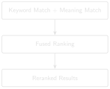
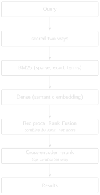

# Hybrid Retrieval and Reranking {#sec-chapter-09}

::: {.content-visible when-format="html"}
::: {.pipeline-diagram}
{.diagram-light width="220"}
{.diagram-dark width="220"}
:::
:::

::: {.content-visible when-format="pdf"}
{width="220" fig-align="center"}
:::

::: {.chapter-status}
Progress `█████████░░░░` **9 / 13** &nbsp;·&nbsp; **Estimated time:** 60–75 min &nbsp;·&nbsp; **Difficulty:** 🔴 Advanced
:::

## Learning objectives

By the end of this chapter, you will be able to:

- Explain why semantic search alone underperforms on precise, entity- or
  number-heavy queries.
- Combine BM25 (sparse/exact) and dense (semantic) retrieval using
  Reciprocal Rank Fusion (RRF).
- Explain when and why production systems add cross-encoder reranking on
  top of fused retrieval, and the latency cost it trades for precision.
- Read production retrieval-scoring code closely enough to explain *why*
  a specific formula is written the way it is, not just what it computes.

## Operational Problem

Mike, the completions engineer, is back with the packers question from
Chapter 8: which report had packers fail to set — and why doesn't either
search method alone find it reliably? A query like *"which report had
packers fail to set?"* has both a semantic component (packers, setting, failure —
a topic) and effectively an exact-match component (you want report #49
specifically, not every report that mentions packers in passing). Dense
embeddings capture the topical meaning well but blur precise
distinctions; keyword search (Chapter 3) nails the exact terms but misses
paraphrase entirely. Neither alone is enough — production retrieval
systems combine both.

## Theory

**BM25** [@robertson2009bm25] scores a document by term frequency,
adjusted by how rare each term is across the whole archive (inverse
document frequency, IDF) and normalised for document length. It's decades old,
computationally cheap, and excellent at exact and near-exact matches —
the opposite profile from dense embeddings.

::: {.callout-tip title="Engineering Translation: BM25"}
**BM25** is keyword search's more careful cousin. It still matches exact
words, like Chapter 3's search, but gives more credit for rare, specific
terms ("packers") than common ones ("the"), and adjusts for how long each
report is so a longer report doesn't win just by containing more words
overall.
:::

**Reciprocal Rank Fusion (RRF)** combines two ranked lists by *rank*, not
raw score: for each document, sum `weight / (k + rank)` across both
lists. This sidesteps a real problem — BM25 scores and cosine
similarities live on completely different, incomparable scales, so
averaging raw scores directly would let whichever signal happens to have
larger numbers dominate regardless of which is actually more informative.

::: {.callout-tip title="Engineering Translation: Reciprocal Rank Fusion"}
Think of two judges ranking the same horse race. One scores out of 10,
the other out of 100 — their raw scores can't be averaged meaningfully.
But their *placings* (1st, 2nd, 3rd...) mean the same thing regardless of
scale. **RRF** combines two search results the same way: by where each
report placed in each ranking, not by the raw number each method
happened to produce.
:::

::: {.content-visible when-format="html"}
::: {.pipeline-diagram}
{.diagram-light width="240"}
{.diagram-dark width="240"}
:::
:::

::: {.content-visible when-format="pdf"}
{width="240" fig-align="center"}
:::

**Cross-encoder reranking** is the last, most expensive step, and
deliberately runs on only the top handful of fused candidates, not the
whole archive. Unlike a dense embedding (which encodes the query and each
document *separately*, then compares vectors), a cross-encoder scores the
query and a candidate passage *together*, letting it capture interactions
between them that no fixed vector representation can. This makes it
substantially slower per comparison — which is exactly why it's applied
after fusion has already narrowed the field, not instead of it.

::: {.callout-tip title="Engineering Translation: Cross-encoder"}
A dense embedding is like summarizing the query and each report
separately, then comparing the two summaries from a distance. A
**cross-encoder** instead reads the query and one candidate passage
*side by side, together*, and judges the pair directly — closer to how a
person actually double-checks a match, but too slow to do for every
report, which is why it only runs on the small shortlist fusion already
produced.
:::

## Reading the real fusion code

The companion pipeline's `src/rag_pdf/retrieval/hybrid_utils.py` and
`src/rag_pdf/services/search_service.py` implement exactly this pipeline.
Two details in the real code are worth understanding closely, because
they're the kind of thing that looks like a stylistic choice until you
see what breaks without it.

::: {.callout-tip title="Detail 1: the IDF formula's shape isn't arbitrary"}
In plain terms: this line makes sure a very common word can never make a
report's score go *negative*. Here's the code:

```python
self.idf[term] = math.log(1.0 + ((self.n_docs - df + 0.5) / (df + 0.5)))
```

Compare this to the classic Robertson-Sparse-Selection IDF,
`log((N - df + 0.5) / (df + 0.5))` *without* the `1.0 +`. For a term that
appears in almost every document (`df` close to `n_docs`), the classic
formula's ratio drops below 1 and the log goes **negative** — which then
corrupts any downstream sum that assumes term contributions are
non-negative. Wrapping the ratio as `1.0 + ratio` before taking the log
guarantees the result stays non-negative for every possible `df`, because
`1.0 + ratio` can never fall below 1. This single design choice removes
an entire category of edge case, permanently, for a cost of one added
constant.
:::

::: {.callout-tip title="Detail 2: normalization has to define its own tie-break"}
In plain terms: this guards against a division that would otherwise
break the whole calculation whenever every candidate ties. Here's the
code:

```python
if hi <= lo:
    return {i: 0.0 for i in candidates}
```

Min-max normalization rescales scores into `[0, 1]` by subtracting the
minimum and dividing by the range. If every candidate in a batch scores
identically, `hi - lo` is zero — a division that, left unguarded, would
raise or produce `NaN`. The guard above catches that case explicitly and
returns a neutral value (0.0 for everyone) instead, so a tie in *this*
signal doesn't crash the pipeline or corrupt the fused score — the other
signal in the fusion is still free to discriminate between the tied
candidates.
:::

Neither of these edge cases shows up by running "more queries" against
typical text — they only show up by reasoning about the math at its
boundaries: what happens when a term is universal, what happens when
every score ties. Retrieval scoring is numerical code, and it deserves
the same edge-case discipline you'd apply to any other numerical code.
The fusion weights themselves are also plain, readable constants in
`search_service.py`: `RRF_K = 20`, `RRF_DENSE_WEIGHT = 0.5`,
`RRF_BM25_WEIGHT = 2.0` — the exact-match signal is weighted four times
higher than the semantic one in this pipeline's fused ranking, reflecting
that for DDR text, exact-term matching often carries more precision than
pure similarity.

## Implementation

### Step 1: fuse two ranked lists by rank, not raw score

**What problem are we solving?**

Combine two independently-ranked lists of reports — one from BM25, one
from dense/semantic search — into a single fused ranking, without
letting whichever method happens to produce larger raw numbers unfairly
dominate the result.

**Inputs**

- `ranked_lists`: two or more ranked lists of document IDs, best match
  first (e.g. one from Chapter 3's keyword search, one from Chapter 4's
  semantic search).
- `k`: a constant controlling how much rank position matters.
- `weights`: how much to trust each list relative to the others.

**Expected Output**

A single fused ranking: a list of `(doc_id, score)` pairs, sorted
highest-scoring first.

```{python}
#| eval: false
# code/chapter_09/hybrid_search.py
from collections import defaultdict

def reciprocal_rank_fusion(ranked_lists: list[list[str]], k: int = 20,
                            weights: list[float] | None = None) -> list[tuple[str, float]]:
    weights = weights or [1.0] * len(ranked_lists)
    scores: dict[str, float] = defaultdict(float)
    for ranked_list, weight in zip(ranked_lists, weights):
        for rank, doc_id in enumerate(ranked_list, start=1):
            scores[doc_id] += weight * (1.0 / (k + rank))
    return sorted(scores.items(), key=lambda item: item[1], reverse=True)
```

**What just happened?**

For every report, this adds up a small credit from each ranked list based
on *where it placed* — a high rank (near the top) contributes a bigger
credit than a low rank, scaled by that list's weight — then sorts every
report by its total credit. Because this uses each list's rank, not its
own raw numbers, a method that happens to score everything on a bigger
scale can't unfairly take over the fused result. (The `key=lambda item:
item[1]` on the sort line is just Python's way of saying "order by the
second thing in each pair" — here, the fused score rather than the report
name.)

### Step 2: turn that into a real hybrid search

`reciprocal_rank_fusion` fuses ranked lists — but it needs two of them to
fuse. Chapter 4's semantic `search()` already returns one. The missing
piece is a ranked *sparse* signal: Chapter 3's `search()` returns an
unordered set — a report either contains every query word or it doesn't —
which RRF has nothing to order. `code/chapter_09/sparse_ranking.py` closes
that gap with `rank_bm25()`, a BM25 ranking over the same archive (with a
plain term-frequency fallback if `rank-bm25` isn't installed):

```{python}
#| eval: false
# code/chapter_09/sparse_ranking.py
from rank_bm25 import BM25Okapi

def rank_bm25(text_dir, query):
    paths = sorted(text_dir.glob("*.txt"))
    corpus = [tokenize(p.read_text(encoding="utf-8")) for p in paths]
    scores = BM25Okapi(corpus).get_scores(tokenize(query))
    ranked = sorted(zip(paths, scores), key=lambda ps: ps[1], reverse=True)
    return [p.name for p, _ in ranked]
```

With both ranked signals in hand, `hybrid_search()` in
`code/chapter_09/hybrid_search.py` runs all three steps end to end: BM25
sparse ranking, Chapter 4's dense ranking, fused with the weights above.
That's the function the practical exercise below calls.

One consistency note, tying back to Chapter 4: BM25 is a lexical method,
so by that chapter's Field Note it belongs on the *expanded* text, while
the dense signal uses the raw. This exercise runs both over the same raw
sample archive for simplicity, and for its queries that's harmless — the
report you're checking for tops the BM25 ranking either way (report #49
for `"packers fishing"`, report #38 for `"stuck pipe"`). Where it *would*
matter is an abbreviation query like `"bottom hole assembly"`: on expanded
text BM25 surfaces report #38, which only ever writes `BHA`; on raw text
it misses it entirely. A production pipeline points the sparse signal at
the expanded text for exactly that reason.

## Production Reality

This chapter tunes two signals with fixed weights (BM25 × 2.0, dense ×
0.5) chosen for DDR text specifically. Real systems have to keep that
tuning honest over time, not treat it as a one-time decision:

- these weights were tuned for this domain's language — a different
  report type (well completions versus drilling, say, or a different
  operator's writing style) may need genuinely different weights, not the
  same ones reused out of habit
- cross-encoder reranking adds real per-query latency, the same way an
  LLM call does (Chapter 5) — it has to be budgeted for, not just
  switched on and forgotten
- production systems often fuse more than two signals — metadata filters
  like well name, date range, or report type frequently join BM25 and
  dense scores in the same fusion step, and each added signal is one more
  way the weighting can go wrong
- as this chapter's own Field Notes show below, adding a signal isn't
  automatically an improvement — a production system needs ongoing
  evaluation (Chapter 11), not a one-time tuning pass assumed to hold
  forever

## Practical exercise

🟢 **Beginner**

**Try it yourself:** Rank the ten sample DDRs for `"packers fishing"` two
ways — `rank_bm25()` for the sparse signal, Chapter 4's `search()` for the
dense one — then fuse them with `reciprocal_rank_fusion([sparse, dense],
k=20, weights=[2.0, 0.5])`, matching the companion pipeline's real
weighting. `hybrid_search()` does all three steps in one call if you'd
rather run it end to end.

**You'll know it worked when:** report #49 (packers) and #50 (fishing)
both rank in the top two of the fused list, and you can explain why the
weighting favours the keyword signal here.

## Field notes

::: {.callout-warning title="🔧 Field notes: hybrid fusion isn't automatically better — check both directions"}
**Query:** the same `"stuck pipe"` query from Chapters 3 and 4.

**Result:** with the pipeline's real fusion weights (BM25 × 2.0, dense ×
0.5), report #39 ranks **9th of 10** — *worse* than Chapter 4's
dense-only search, which ranked it 5th. Equal weighting (1.0 / 1.0)
still only gets it to 7th.

```
BM25 alone:    report #39 ranks 9th of 10
Dense alone:   report #39 ranks 5th of 10   (Chapter 4)
RRF (2.0/0.5): report #39 ranks 9th of 10   (pipeline default weights)
RRF (1.0/1.0): report #39 ranks 7th of 10
```

Compare that to `"packers fishing"` (the practical exercise above),
where fusion helps exactly as expected — report #49 stays 1st and
report #50 jumps from 8th (dense alone) to 2nd (fused).

You can reproduce every rank above with this book's own code:
`rank_bm25()` and `hybrid_search()` (from the implementation section)
give report #39 exactly these positions over the sample archive — 9th on
BM25 alone, 9th fused at 2.0/0.5, 7th at 1.0/1.0. The companion
pipeline's fuller BM25 implementation
(`DDR_UTAH_FORGE/src/rag_pdf/retrieval/hybrid_utils.py`) lands on the same
ordering for this query, which is a good sign the simplified version here
captures what actually matters.

**Why:** BM25 has essentially nothing useful to say about report #39 for
`"stuck pipe"` — it shares almost no vocabulary with the query, so BM25
ranks it 9th on its own. Fusing that weak, near-random signal in with a
weight of `2.0` doesn't cancel out — it actively drags a mediocre dense
result down further. For `"packers fishing"`, by contrast, both signals
carry real information (the word "fishing" genuinely appears in report
#50), so combining them helps.

**Lesson:** hybrid retrieval's benefit depends on *both* signals being
informative for the query at hand — not on combining more signals being
unconditionally better. A sparse signal with nothing to contribute isn't
neutral when fused; it's noise with a weight attached, and can make a
weak dense ranking worse. This is exactly why Chapter 11 insists on
per-category evaluation rather than one aggregate score — "hybrid beats
dense on average" can still be actively wrong for a specific,
operationally important query like this one.
:::

## Challenge exercise

🔴 **Advanced**

**Challenge:** Implement the two guards from the code study above against
deliberately constructed edge cases: a term that appears in every sample
document (test that your IDF stays non-negative), and a batch where every
candidate scores identically (test that your normalization doesn't
divide by zero). Confirm an unguarded version fails first. A reference
solution is in `code/chapter_09/challenge/`.

## Key takeaways

- Sparse and dense retrieval fail on different, complementary query
  types — combine them rather than picking one.
- Rank-based fusion (RRF) avoids the scale-mismatch problem that plagues
  naive score-averaging across different retrieval methods.
- Cross-encoder reranking buys precision at a real latency cost — apply
  it only to a small, already-fused candidate set.
- Retrieval scoring is numerical code. Boundary conditions — universal
  terms, tied scores — deserve explicit guards, and reading *why* a
  formula is shaped the way it is tells you more than reading what it
  computes.

## Repository files

| File | Purpose |
|---|---|
| `code/chapter_09/sparse_ranking.py` | Ranked BM25 sparse retriever — the ranked signal RRF fuses |
| `code/chapter_09/hybrid_search.py` | Reciprocal Rank Fusion, plus `hybrid_search()` end-to-end |
| `DDR_UTAH_FORGE/src/rag_pdf/retrieval/hybrid_utils.py` | BM25 index, IDF formula, score fusion (companion repo — requires DDR_UTAH_FORGE) |
| `DDR_UTAH_FORGE/src/rag_pdf/retrieval/canonical_hybrid.py` | Full hybrid retrieval pipeline (companion repo — requires DDR_UTAH_FORGE) |
| `DDR_UTAH_FORGE/src/rag_pdf/services/search_service.py` | Cross-encoder rerank + fusion weights (companion repo — requires DDR_UTAH_FORGE) |

::: {.callout-caution title="CHECKPOINT — Chapter 9"}
- [x] Explained why semantic search alone underperforms on precise, entity-heavy queries
- [x] Combined BM25 and dense retrieval using Reciprocal Rank Fusion
- [x] Read production scoring code closely enough to explain why its guards exist
- [x] Confirmed fusion helps on one query and actively hurts on another, using real evidence
:::

::: {.callout-tip .built-box title="✓ WHAT YOU BUILT"}
**`hybrid_search.py`** — a Reciprocal Rank Fusion engine combining
keyword and semantic retrieval into one ranked list that plays to both
methods' strengths.
:::

## What can you do now that you couldn't do before?

You can combine exact keyword matching and semantic search into a single
ranked list that plays to each method's strengths — and, from real
evidence rather than assumption, you know that combining signals only
helps when both of them actually have something useful to say about the
query at hand.

## Suggested next step

**Coming up in Chapter 10:** Better retrieval still isn't the same as a
trustworthy answer. Chapter 10 tackles the harder problem: making sure
every generated claim traces back to real evidence, and that the system
tells you honestly when it doesn't know.
