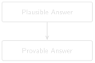

# Traceable Answers and Hallucination Mitigation {#sec-chapter-10}

::: {.content-visible when-format="html"}
::: {.pipeline-diagram}
{.diagram-light width="170"}
{.diagram-dark width="170"}
:::
:::

::: {.content-visible when-format="pdf"}
{width="170" fig-align="center"}
:::

::: {.chapter-status}
Progress `██████████░░` **10 / 12** &nbsp;·&nbsp; **Estimated time:** 60–75 min &nbsp;·&nbsp; **Difficulty:** 🔴 Advanced
:::

## Learning objectives

By the end of this chapter, you will be able to:

- Distinguish questions that should be answered by generation from
  questions that should be answered by structured data lookup.
- Attach a verifiable citation (report number, page, and date) to every
  claim a system produces.
- Detect and surface gaps in your own source archive, so the system's
  silence about a period isn't mistaken for "nothing happened."

## Operational Problem

Sean, the production engineer, asks a pointed question after seeing a
generated number in a draft report: *"Can you actually prove that number,
or did the model just make it sound right?"* Chapter 5 built a prompt
that *asks* a language model to cite
sources — necessary, but not sufficient. A model can still cite a
plausible-sounding report number for a number it invented, especially for
arithmetic questions ("how many hours of non-productive time in
November?") that language models are statistically bad at answering
exactly, no matter how good the prompt is. Separately, this archive —
like any real archive — has a genuine gap, and a system that answers
confidently from what it *has*, without flagging what it's *missing*, can
quietly mislead an engineer who assumes silence means nothing happened.

## Structured facts, already extracted

Language models can produce fluent, plausible claims that are simply
false — a well-documented failure mode called hallucination
[@ji2023hallucination].

::: {.callout-tip title="Engineering Translation: Hallucination"}
A **hallucination** is a confident wrong answer — the language-model
equivalent of a new hire who guesses a number rather than admitting "I
don't know," and says it fluently enough that nobody thinks to
double-check. It isn't lying on purpose; it's producing text that sounds
right without anything underneath actually verifying it.
:::

The single most effective mitigation in this book
is a rule of thumb, not a model trick: **if a question can be answered by
looking something up or computing it from structured data, don't generate
the answer — compute it.**

Every report in this archive has already been parsed into a real,
structured `ddr_facts.parquet` table by the companion pipeline. Here's an
actual row from report #38 (2020-11-26):

::: {.callout-note title="A real row from ddr_facts.parquet, report #38"}
```
report_date: 2020-11-26        wellbore: FORGE-16A-78-32
start_time:  06:00              end_time:      11:00
duration_hr: 5.0                 phase:         Production Drilling
op_code:     Wire Line Logs      is_npt:        False
operation_text: "PJSM, pre job safety meeting. Rig up Schlumberger
                  run the UBI log from 5.200 to surface. Rig down
                  logging tools."
```
:::

A question like *"how many hours did report #38 spend on wireline
logging?"* has an exact answer sitting in this table —
`duration_hr = 5.0` — computed once during extraction, not re-derived by
a language model each time it's asked. Generation is reserved for what
it's actually good at — narrative synthesis across multiple passages —
and even then, every claim carries its source.

```
question
   ↓
answerable from structured data?
   ↓
yes -> query ddr_facts.parquet
    -> exact, re-derivable answer
   ↓
no  -> retrieve + generate (Ch.5)
    -> answer + citations
       (verify before trusting)
```

## A real, honest gap in this archive

The second mitigation is **corpus-completeness awareness**. This archive
has a genuine one: the last Drilling report is #76, dated **2021-01-03**.
The Completion report (a DFIT — Diagnostic Fracture Injection Test) is
dated **2021-01-06**. Two calendar days — January 4th and 5th — have no
report of any kind. Every other day in the drilling programme, from spud
on October 30, 2020 through report #76, has exactly one report, so this
gap is real and specific to the Drilling-to-Completion handover, not an
artefact of messy source data.

A RAG system only knows what's in its index. If you ask it "what happened
on January 5th, 2021?" without gap-awareness, a poorly built system might
either hallucinate an answer or simply retrieve the nearest chunks (report
#76 or the Completion report) without ever telling you neither actually
covers that date. Detecting the gap is a matter of checking the
*sequence* of report numbers and dates for holes — not the content, just
the presence.

## Implementation

### Step 1: give every claim a checkable tag

## What problem are we solving?

Attach a checkable source to every claim — which report, which page —
instead of a citation-shaped sentence a reader has to take on faith.

## Inputs

- A report name/number, and an optional page number.
- A list of such citations to attach to one answer.

## Expected Output

A plain-text "Evidence:" block listing each source, ready to show
alongside a generated answer.

```{python}
#| eval: false
# code/chapter_10/traceable_answers.py
from dataclasses import dataclass

@dataclass
class Citation:
    report: str
    page: int | None = None

def format_evidence(citations: list[Citation]) -> str:
    lines = [f"  {c.report}" + (f" page {c.page}" if c.page else "") for c in citations]
    return "Evidence:\n" + "\n".join(lines)
```

## What just happened?

`Citation` bundles a report and a page number together as one unit — the
equivalent of an evidence tag on an exhibit, so a claim's source can never
get separated from the claim itself by accident. `format_evidence` turns
a list of those tags into a plain block of text a reader can check
against the real reports, one line per source.

::: {.callout-tip title="Engineering Translation: Dataclass"}
A **dataclass** like `Citation` is a small, labelled bundle of related
facts — the code equivalent of an equipment tag that keeps a part number
and its location together on one card, instead of as two separate loose
numbers you could mix up.
:::

### Step 2: check the archive for real gaps

## What problem are we solving?

Detect whether the archive has days with no report at all, so the system
can say "I have nothing for that date" instead of guessing or silently
retrieving the nearest available report.

## Inputs

- A list of report dates, as ISO date strings, covering a period that
  should have one report per day.

## Expected Output

A list of `(start, end)` date ranges with no report — empty if the
archive is complete.

```{python}
#| eval: false
def find_date_gaps(report_dates: list[str]) -> list[tuple[str, str]]:
    """Return (start, end) date ranges with no report, given a sorted
    list of ISO date strings covering a continuous daily-reporting period."""
    from datetime import date, timedelta

    dates = sorted(date.fromisoformat(d) for d in report_dates)
    gaps = []
    for prev, curr in zip(dates, dates[1:]):
        missing_days = (curr - prev).days - 1
        if missing_days > 0:
            gaps.append(((prev + timedelta(days=1)).isoformat(), (curr - timedelta(days=1)).isoformat()))
    return gaps
```

## What just happened?

The dates get sorted, then checked one consecutive pair at a time: if
more than one day passes between two reports, everything in between gets
recorded as a missing range. No content is inspected here at all — this
only checks whether a report *exists* for each day, which is exactly
enough to catch the real two-day gap in this archive.

### Step 3: build a citation from a real search, not by hand

## What problem are we solving?

Every `Citation` shown so far in this chapter was typed in by hand —
`Citation(report="...", page=1)` — which proves the data structure works
but not that the *system* can produce one. A citation is only actually
trustworthy if it comes from the same retrieval the answer itself used.
This step closes that loop: run a real query against Chapter 8's
chunk-level index, and read the report, page, and date straight off
whichever chunk matched — never re-typed, never assumed.

## Inputs

- Chapter 8's `build_chunk_metadata_index()` and `search()`.
- A query string.

## Expected Output

A list of `Citation` objects built entirely from the search results —
real reports, real pages, real dates, in ranked order.

```{python}
#| eval: false
@dataclass
class Citation:
    report: str
    page: int | None = None
    report_date: str | None = None  # "report_date": date is the stdlib class

def citations_from_search(chunk_results: list[tuple[int, float]],
                           metadata: list[dict]) -> list[Citation]:
    citations = []
    seen_report_pages = set()
    for idx, _score in chunk_results:
        report_page = (metadata[idx]["report"], metadata[idx]["page"])
        if report_page in seen_report_pages:
            continue
        seen_report_pages.add(report_page)
        citations.append(Citation(report=metadata[idx]["report"], page=metadata[idx]["page"],
                                   report_date=metadata[idx].get("date")))
    return citations
```

## What just happened?

For every `(row_index, score)` pair a search returns, this looks up
`metadata[row_index]` — the real report, page, and date Chapter 8
recorded for that exact chunk — and wraps it in a `Citation`. There's no
separate "figure out the source" step: the metadata was attached back
when the chunk was indexed, so reading it is all citing requires. The
field is named `report_date`, not `date` — `date` is already the name of
the standard library class this file imports below for `find_date_gaps`,
and shadowing it would be its own quiet bug waiting to happen.

The `seen_report_pages` set is doing real work, not defensive
boilerplate. A long page gets split into several chunks by Chapter 7's
chunker, and more than one of those chunks can land in the same top-k
result — so without this check, one report page can show up in the
Evidence list two, three, or four times, drowning out how many
*distinct* sources actually back the answer. Only the first — and
therefore best-ranked — chunk from each `(report, page)` pair is kept;
later duplicates are skipped.

Run this against the real archive for `"stuck pipe"` at `top_k=3` and
the top result is:

```
Evidence:
  FORGE-16A-78-32_Drilling_038_2020-11-26.txt page 1 (2020-11-26)
```

That's the same report #38 this whole book has used for the stuck-pipe
story, cited automatically from a live search — not because the example
was written to come out that way, but because Chapter 8 already
verified report #38 ranks 1st for this exact query against the real
chunk-level index. Every DDR in this sample archive is a single page, so
`page` reads `1` every time here; the code doesn't know that in advance,
and would report page 4 just as readily on a report that actually had
one, which is the entire point of building it this way instead of typing
`page=1` by hand. The date, unlike the page, isn't a Chapter 7 invention
at all — it was always sitting in the filename; this step is the first
place anything actually reads it.

Widen the same query to `top_k=10` and the gap the deduplication closes
becomes visible: 10 chunk results come back, but only 6 distinct
`(report, page)` pairs are behind them — the Completion report alone
supplies four of the ten chunks. Without deduplication, the Evidence
list would repeat that one report four times and imply four independent
sources instead of one.

## Production Reality

This chapter's citation and gap-detection code both assume the
underlying extraction is trustworthy — but structured extraction is still
code, written by someone, and can encode a judgment call worth checking
(see this chapter's own Field Notes on `is_npt` below). A deployed system
has more to plan for:

- gap detection has to run continuously as new reports arrive, not just
  once at setup — a system that only checked for gaps on day one won't
  notice a new one appearing three months later
- not every gap is administrative silence — a missing day could mean a
  missing safety report, which is worth escalating to a person, not just
  logging quietly as "no data for this date"
- a citation is only useful if someone actually reads it — a system that
  buries the evidence list at the bottom of a long answer, in small
  print, earns the same blind trust as a system with no citations at all
- some engineering decisions (regulatory submissions, incident reports)
  require a human sign-off no matter how good the system's citations
  are — traceability supports a human reviewer, it doesn't replace one

## Practical exercise

🟢 **Beginner**

**Try it yourself:** Run `find_date_gaps()` against the report dates in
this book's ten-report sample — `["2020-10-22", "2020-11-07",
"2020-11-24", "2020-11-25", "2020-11-26", "2020-11-27", "2020-12-06",
"2020-12-07", "2020-12-08", "2021-01-06"]`.

**You'll know it worked when:** the function reports several gaps — most
of them simply reflecting that Part I's curated subset skips most of the
archive's days on purpose. Then run it against the *full* 76-report
archive's dates (`datasets/forge_archive/`) and confirm it finds exactly
one real gap: January 4th–5th, 2021, right before the Completion report.

## Field notes

::: {.callout-warning title="🔧 Field notes: verify the automatic label, not just the automatic lookup"}
**Action:** check the real, computed `is_npt` flag — set once during
extraction, not re-derived on every query — for every operations row on
report #38, the stuck-pipe day.

**Result:** out of ten rows covering the full 24 hours, exactly **one**
is flagged `is_npt = True`:

```
23:30-04:00  is_npt=True   "Drill From 6,360' to 6,507'... During the
                            slide lost tool face and became assembly
                            became stuck"
04:00-06:00  is_npt=False  "Work pipe, circulate lube sweep, work tool
                            back in position, Pipe free"
```

**Why:** the classifier flagged the 4.5-hour block where the pipe
*became* stuck, but not the following 2-hour block where the crew
actually recovered it. That's a defensible reading — the drilling
operation is what got interrupted — but it's also a real judgment call:
an engineer asking "how many hours did this stuck-pipe event cost?"
would probably expect all 6.5 hours counted, not 4.5.

**Lesson:** a structured field being *automatically extracted* doesn't
mean it's automatically *correct for your question*. Trusting
`ddr_facts.parquet` blindly here would silently undercount the incident
by 2 hours, every time someone asks. The fix isn't to distrust structured
data — Chapter 10's whole argument is that it beats generation — it's to
read the classification logic once, understand exactly what it counts,
and know the edge it sits on before you build a report or a chart on top
of it.
:::

## Challenge exercise

🟠 **Intermediate**

**Challenge:** Extend `find_date_gaps()` to classify each gap's severity
(e.g. a gap under 3 days is Low; a gap that crosses a report-type boundary
— Drilling to Completion, as this one does — is High regardless of
length, since it likely represents an unrecorded operational transition).
A reference solution is in `code/chapter_10/challenge/`.

## Key takeaways

- Prefer structured lookup over generation whenever the question is
  answerable from data you already extracted — it's exact, not just
  plausible.
- Every generated claim needs a citation an engineer can independently
  check, not just a citation-shaped sentence.
- A citation is only as trustworthy as where its fields come from — a
  hand-typed `page=1` proves the data structure works, not that the
  system can produce one. Chapters 7-10 wire the real value through:
  Chapter 1's page markers, Chapter 7's per-page chunking, Chapter 8's
  chunk metadata, read back here. Not every field needs that much
  plumbing, though — the report date was sitting in the filename the
  whole time; the work there was reading it, not producing it.
- A system that can tell you what it *doesn't have* is more trustworthy
  than one that answers fluently regardless of coverage — this archive's
  real two-day gap at the Drilling-to-Completion handover is exactly the
  kind of silence worth surfacing explicitly, not filling in.
- Deduplicate citations by `(report, page)`, not just by chunk — a
  chunk-level index can return several chunks from the same page among
  the top-k results, and an Evidence list that repeats one source four
  times looks like four independent sources unless it's collapsed down
  to the distinct ones.

## Repository files

| File | Purpose |
|---|---|
| `code/chapter_10/traceable_answers.py` | Citation formatting, real search-to-citation wiring, and date-gap detection |
| `DDR_UTAH_FORGE/data/processed/qc/raw_pdf_missing_reports.csv` | Real, computed gap-detection output (companion repo) |

::: {.callout-caution title="CHECKPOINT — Chapter 10"}
- [x] Distinguished questions to compute from data versus questions to generate an answer to
- [x] Attached a checkable citation to every generated claim
- [x] Built a real Citation from a live search result, not typed in by hand
- [x] Deduplicated citations so a repeated report/page isn't miscounted as independent evidence
- [x] Detected a real gap in the archive instead of silently assuming completeness
- [x] Caught a structured field's judgment call, not just trusted it blindly
:::

::: {.callout-tip .built-box title="✓ WHAT YOU BUILT"}
**`traceable_answers.py`** — a citation and gap-detection layer: every
claim carries a real, live-search-sourced citation — report, page, and
date, never hand-typed — and every silence in the archive gets surfaced
instead of hidden.
:::

## What can you do now that you couldn't do before?

You can tell the difference between a question you should compute from
data you already have and one you should generate an answer to — and you
can prove, with a citation built from a real search result (not typed in
by hand), exactly where every part of a generated answer came from,
including telling an engineer honestly when the archive simply has
nothing to say.

## Suggested next step

**Coming up in Chapter 11:** You now have a system that retrieves well
and answers honestly. Chapter 11 asks the question every system like this
eventually needs answered with numbers, not impressions: *how good is it,
really* — and where specifically does it still fail?
