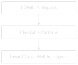
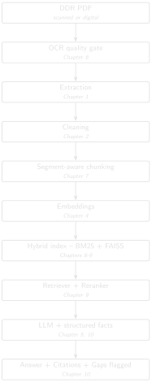

# Sequence Detection: Building Toward Cross-Well Intelligence {#sec-chapter-12}

::: {.content-visible when-format="html"}
::: {.pipeline-diagram}
{.diagram-light width="220"}
{.diagram-dark width="220"}
:::
:::

::: {.content-visible when-format="pdf"}
{width="220" fig-align="center"}
:::

::: {.chapter-status}
Progress `████████████░` **12 / 13** &nbsp;·&nbsp; **Estimated time:** 60–90 min &nbsp;·&nbsp; **Difficulty:** 🔴 Advanced
:::

## Learning objectives

By the end of this chapter, you will be able to:

- Combine structured numeric trends (torque, ROP) with narrative
  operation text to build a single, checkable operational story.
- Explain how a windowed leading-indicator detector works — and verify,
  from real thresholds in production code, exactly what "causal" and
  "escalating" mean before trusting either label.
- Understand honestly what this book's single-well archive can and can't
  demonstrate, and what it would take to scale this technique to genuine
  cross-well intelligence.

## Operational Problem

Sarah, the intervention engineer, asks the payoff question every
previous chapter has been building toward: *"Did something earlier
predict trouble later?"* A human reading 76
reports in sequence can, with effort, spot a pattern — but a system that
has structured, classified, and indexed the same text can hold every
report in mind at once, and check numeric trends a human would have to
read a table on every single page to notice.

This chapter is deliberately honest about scale: Utah FORGE's public
archive is **one well, one continuous drilling programme** — not the
multi-well, multi-phase campaign this book's companion pipeline was
originally built to analyse. So instead of presenting a large statistical
finding, this chapter shows you exactly how to check a real, small
pattern by hand, using the same technique — and shows you precisely what
production code exists to scale that technique up once you have more
than one well's worth of data.

## A real, checkable pattern

Report #38's `TORQUE` header field — a single number recorded every day
regardless of what happens — tells a real story across three consecutive
days:

::: {.callout-note title="Real header data, reports #36-38"}
```
Report #36 (2020-11-24): TORQUE: 4,400
Report #37 (2020-11-25): TORQUE: 4,200
Report #38 (2020-11-26): TORQUE: 5,615 (header) / 6,500 (during the slide)
                          "During the slide lost tool face and became
                           assembly became stuck"
```
:::

Torque was flat — even slightly down — for two days, then jumped by
roughly a third on the same day the assembly became stuck.

::: {.callout-tip title="Engineering Translation: Leading indicator vs. same-day correlation"}
A **leading indicator** is a signal that shows up *before* the trouble —
like a rising torque trend days ahead of an actual stuck-pipe event, which
would genuinely give you warning. A **same-day correlation** just means
two things moved together on the same day — useful evidence that they're
related, but it confirms trouble, it doesn't predict it. This chapter's
torque pattern is the second kind, and it matters to be precise about
which one you're actually looking at.
:::

This is a same-day correlation between a structured number and a
narrative event, not a multi-day advance warning — and that distinction
matters. Don't claim a leading indicator you haven't actually verified
extends before the event; this pattern says "torque and the stuck-pipe
event moved together," not "torque predicted the stuck pipe two days
out."

Chapter 5's other real sequence — report #49's packers failing to set,
followed same-day by picking up a fishing BHA, followed by report #50's
actual fishing operation — is a genuine two-report causal chain, directly
traceable and already fully verified with real text.

## Theory: how the production tool would check this at scale

The companion pipeline's `src/ddr_rag/causality_analyzer.py` — part of
`DDR_UTAH_FORGE`, not this book's repository — implements exactly this
kind of check, generalized: for a given term, it compares frequency in a
window before and after a boundary date, and labels a term **causal**
only above a defined post-boundary NPT rate, and **escalating** only
above a defined frequency-increase ratio. The thresholds below are
reported directly from that module, not something you can inspect or run
with this book's own bundled code:

```python
TRANSITION_WINDOW_DAYS = 14   # days before/after a boundary to compare
MIN_TERM_FREQ = 3             # minimum occurrences before a term counts at all
NPT_SIGNAL_THRESHOLD = 0.40   # post-boundary NPT rate to call a term "causal"
ESCALATION_FREQ_RATIO = 1.5   # frequency increase to call a term "escalating"
```

::: {.callout-tip title="Engineering Translation: Threshold constants"}
These four lines are named, readable numbers you could point to on a
whiteboard and defend in a meeting — "we call it escalating once
frequency rises by 50%" — rather than a judgment buried invisibly inside
a trained model's weights. Anyone can read them, question them, and
change them without touching the logic around them.
:::

Every one of these is a plain, readable number you can inspect, change,
and justify — not a weight buried inside a trained model.

::: {.callout-important title="A real limitation worth understanding, not hiding"}
This module's default phase configuration —
`["MIRU", "COND1", "INTRM1", "INTRM2", "PROD1", "COMPZN"]` — comes from
`operator_alpha`, a different (private, North Sea) campaign's phase
vocabulary. Utah FORGE's real data doesn't have that phase structure: its
`ddr_facts.parquet` phase field is `"Production Drilling"` for
essentially the entire programme, right up to the Completion-DFIT report.
Running `causality_analyzer.py` against this archive as-is would compare
windows around phase boundaries that don't meaningfully exist in this
well's data — the code would run, but the output wouldn't mean anything
useful yet.

This is a genuinely common situation in real engineering work: code
built and validated on one dataset doesn't automatically transfer to
another just because the file paths line up. Before trusting output from
an adapted pipeline, check that the assumptions baked into its
configuration (here, a phase vocabulary) actually match your data. The
`src/ddr_rag/npt_classifier.py` module, by contrast, *has* been adapted
for Utah FORGE specifically — `classify_utah_forge_npt()` exists and
recognises this archive's real fields — which tells you adaptation here
is partial, not absent: some layers of this pipeline are ready for this
well's data, and some aren't yet.
:::

## Implementation

### Step 1: measure day-over-day change, not just the raw numbers

**What problem are we solving?**

Turn a list of daily torque readings into a measured day-over-day
percentage change, so "roughly a third" becomes an exact, checkable
number.

**Inputs**

- `readings`: a chronological list of `(date, torque_value)` pairs.

**Expected Output**

A list of `(date, torque_value, percentage_change)` — one entry for every
day after the first, since a percentage change needs a previous day to
compare against.

```{python}
#| eval: false
# code/chapter_12/torque_trend_check.py
def torque_trend(readings: list[tuple[str, float]]) -> list[tuple[str, float, float]]:
    """Given [(date, torque_value), ...] in chronological order, return
    each day's percentage change from the previous day."""
    trend = []
    for (prev_date, prev_val), (date, val) in zip(readings, readings[1:]):
        pct_change = (val - prev_val) / prev_val if prev_val else 0.0
        trend.append((date, val, pct_change))
    return trend
```

**What just happened?**

This walks through the readings one consecutive pair at a time and
computes how much each day's torque changed relative to the day before,
as a percentage — the exact arithmetic behind the "flat, then a third
higher" story told in prose above.

### Step 2: run it against report #38's real numbers

**What problem are we solving?**

See the actual percentage change for reports #36–38, printed as real
numbers instead of an approximate description.

**Inputs**

- The three real `TORQUE` header values from reports #36, #37, and #38.

**Expected Output**

```
2020-11-25: 4200 (-4.5%)
2020-11-26: 5615 (+33.7%)
```

```{python}
#| eval: false
readings = [
    ("2020-11-24", 4400),
    ("2020-11-25", 4200),
    ("2020-11-26", 5615),
]
for date, val, pct in torque_trend(readings):
    print(f"{date}: {val} ({pct:+.1%})")
```

**What just happened?**

Running the real header values through `torque_trend` confirms the
pattern precisely: a 4.5% *dip* the day before, then a 33.7% jump on the
stuck-pipe day itself — turning "roughly a third" into an exact,
reproducible number sourced from the report headers themselves.

## Production Reality

This chapter's torque check works because Utah FORGE's header format is
completely consistent, and because a single well gives you exactly one
example of the pattern. Genuine cross-well intelligence has different
demands entirely:

- different rigs and BHA configurations have different normal torque
  ranges — a 25% jump threshold tuned on this well could be meaningless,
  or far too sensitive, on a well drilled with different equipment
- not every operator's DDR software populates a header field as cleanly
  as WellEz does here — a real multi-operator archive may need
  per-source parsing before any threshold-based check is even possible
- one well gives you one instance of a pattern, which is a hypothesis,
  not a finding — genuine cross-well intelligence needs enough wells to
  tell a real, recurring precursor apart from coincidence, which is
  exactly why the companion pipeline's `causality_analyzer.py` was built
  against a many-well campaign in the first place
- as the callout above shows, code built and tuned for one dataset's
  phase vocabulary doesn't just work on a new dataset because the file
  paths match — every threshold and configuration assumption needs
  re-checking against the new data before you trust its output

## Practical exercise

🟢 **Beginner**

**Try it yourself:** Extend `readings` with report #39's header torque
value (check the PDF yourself — Chapter 1's `read_ddr.py` will get it for
you) and confirm whether the elevated torque persisted after the pipe was
freed, or dropped back toward the pre-event baseline.

**You'll know it worked when:** you can state the real percentage change
for each day, sourced from header fields you extracted yourself, not from
this chapter's text.

## Field notes

::: {.callout-warning title="🔧 Field notes: the pattern doesn't stop at the stuck-pipe day"}
**Action:** read report #39's narrative text — the day *after* the
stuck-pipe day this chapter's torque numbers track — the same lines
Chapter 3's Field Notes already flagged as invisible to keyword search.

**Result:** report #39 says:

- "Work tight hole at 6,526'."
- "Due to high torque decision to pull out of hole"
- "Hole drag from 6,050' to 5,901' no issues"

Continued elevated-torque language, one calendar day after report #38's
header `TORQUE` value jumped 33.7% on the stuck-pipe day itself.

**Why:** this chapter's structured trend check only looks at the
`TORQUE` header field across three days, and stops at report #38. But
report #39's narrative — high torque, a tight hole, a deliberate decision
to pull out of hole — reads like the same operational story continuing
in prose, one day after the structured number spiked.

**Lesson:** a single structured signal, however precise, is one thread
of a larger story. Report #39 is exactly the kind of continuation a
torque-only check would miss entirely, but that hybrid retrieval and
narrative search (Chapters 3-9 combined) can still surface. That's the
whole book's argument, compressed into one field note: no single
technique in this book is sufficient alone — structured checks,
narrative retrieval, and traceable generation each catch what the others
miss.
:::

## Challenge exercise

🔴 **Advanced**

**Challenge:** Pull the `TORQUE` header value for all 76 reports in
`datasets/forge_archive/` (Chapter 1's extraction plus a small regex),
plot it as a time series, and identify every day where torque jumps more
than 25% from the previous day. Cross-reference each jump against that
day's narrative text — how many of them correspond to a real operational
event like report #38's, and how many are unremarkable? A reference
solution is in `code/chapter_12/challenge/`.

## Key takeaways

- A single structured number, tracked day over day, can corroborate a
  narrative event — but be precise about what you've actually shown:
  same-day correlation is not the same claim as a multi-day leading
  indicator, and this chapter deliberately didn't claim more than the
  real data supports.
- Production causality-detection code carries real, inspectable
  thresholds — read them before trusting output, and check that its
  configuration (like a phase vocabulary) actually matches your dataset
  before running it.
- Genuine cross-well intelligence needs more than one well's worth of
  data to compare against — Utah FORGE's `data/fields/UtahForge/wells/`
  structure in the companion pipeline is already organized to support
  additional wells as this research programme (or your own multi-well
  archive) grows.

## Repository files

| File | Purpose |
|---|---|
| `code/chapter_12/torque_trend_check.py` | Day-over-day trend check on a structured header field |
| `DDR_UTAH_FORGE/src/ddr_rag/causality_analyzer.py` | Windowed leading-indicator detection (companion repo — requires DDR_UTAH_FORGE) |
| `DDR_UTAH_FORGE/src/ddr_rag/npt_classifier.py` | Utah-FORGE-adapted NPT classification (companion repo — requires DDR_UTAH_FORGE) |
| `DDR_UTAH_FORGE/data/fields/UtahForge/wells/` | Multi-well data structure, ready for expansion (companion repo — requires DDR_UTAH_FORGE) |

::: {.callout-caution title="CHECKPOINT — Chapter 12"}
- [x] Combined a structured numeric trend with narrative text into one checkable story
- [x] Read real thresholds from production causality-detection code before trusting its labels
- [x] Distinguished a same-day correlation from an unverified leading indicator
- [x] Identified exactly what this single-well archive can't yet demonstrate
:::

::: {.callout-tip .built-box title="✓ WHAT YOU BUILT"}
**`torque_trend_check.py`** — a structured sequence-detection check, and
the first building block toward genuine cross-well intelligence: the
same technique the companion pipeline's `causality_analyzer.py` runs at
scale once more than one well's data exists.
:::

## What can you do now that you couldn't do before?

You can check, by hand and with real numbers, whether a structured trend
and a narrative event actually moved together — and you know precisely
what's still missing (more wells, re-tuned thresholds, a matching phase
vocabulary) before that check becomes genuine cross-well operational
intelligence.

## The complete system

Twelve chapters ago, this was a single PDF and a five-line function.
Here's everything you built, end to end — every arrow below is a chapter
you completed, not an aspiration:

::: {.content-visible when-format="html"}
::: {.pipeline-diagram}
{.diagram-light width="280"}
{.diagram-dark width="280"}
:::
:::

::: {.content-visible when-format="pdf"}
{width="280" fig-align="center"}
:::

Two more pieces sit alongside this pipeline rather than inside it —
they don't run on every query, but they're what make the rest of it
trustworthy at scale:

```
Evaluation (Chapter 11) ---------- measures how well the pipeline above
                                    actually performs, against questions
                                    with known correct answers

Sequence detection (Chapter 12) -- mines what the pipeline has already
                                    indexed for patterns no single query
                                    would surface on its own
```

Every stage exists because an earlier, simpler version of this system
failed at it — a scanned page with no text, a chunk that split a
stuck-pipe sentence in half, a query that missed a report because it
used the wrong three words, a hallucinated number where a table lookup
belonged. None of the complexity here is complexity for its own sake.

## Suggested next step

**Coming up in Chapter 13:** Everything you've built so far processes a
fixed archive in one pass. But these are *Daily* Drilling Reports — one
new report arrives every day. Chapter 13 makes the system live: it folds
each new report into the index as it arrives, without rebuilding, and
keeps the gap check running so you know the morning a report *doesn't*
show up.
