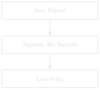
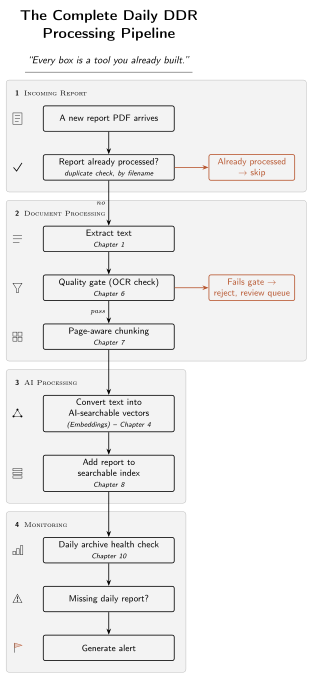
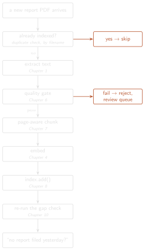

# Daily Ingestion: Keeping the System Live {#sec-chapter-13}

::: {.content-visible when-format="html"}
::: {.pipeline-diagram}
{.diagram-light width="180"}
{.diagram-dark width="180"}
:::
:::

::: {.content-visible when-format="pdf"}
{width="180" fig-align="center"}
:::

::: {.chapter-status}
Progress `█████████████` **13 / 13** &nbsp;·&nbsp; **Estimated time:** 45–60 min &nbsp;·&nbsp; **Difficulty:** 🔴 Advanced
:::

## Learning objectives

By the end of this chapter, you will be able to:

- Explain why a Daily Drilling Report system's real operating mode is
  incremental, not batch — and what breaks if you rebuild from scratch
  every night.
- Ingest a single new report into a live, persisted index by *appending*
  to it, without re-embedding everything that came before.
- Explain why the dense index appends cleanly but the BM25 signal does
  not, and make sure a report never gets added to the index twice.

## Operational Problem

Sean, the production engineer, asks the question every previous chapter
quietly assumed away: *"Report #77 lands tomorrow morning, and I need to
ask about it on the call. Do we rebuild the whole index every night just
to add one page?"*

Everything so far has been **batch**: point the pipeline at a fixed folder
of reports, extract, chunk, embed, and index all of them in one pass. That
is exactly right for learning, and fine for a frozen archive. But these
are *Daily* Drilling Reports. In a real deployment the archive is never
frozen — one new report arrives every day, sometimes several, and the
system has to absorb each one and be ready to answer questions about it
within minutes. Rebuilding the entire index from scratch to add a single
report works at ten documents and is absurd at ten thousand. The job of
this chapter is to add one report to a live system the way the field
actually does it: incrementally.

## Example: a new report arrives

::: {.callout-note title="Ingesting one report into a live index"}
```
Live index before:   296 chunks across 9 reports
New report arrives:   FORGE-16A-78-32_Drilling_050_2020-12-08.pdf
  extract -> quality gate -> chunk -> embed -> append
Live index after:     333 chunks across 10 reports   (+37, no rebuild)
```
:::

That final number is not a coincidence. **333 chunks is exactly what
Chapter 8's one-shot build produces over all ten reports.** Incremental
ingestion and a full rebuild converge on the identical index — appending
just gets there one report at a time, without re-embedding the nine that
were already there.

## Theory

Two facts about the index you built in Chapter 8 make incremental
ingestion possible — and one makes half of it harder than it looks.

**The dense index is append-only, and that's a feature.** FAISS's
`IndexFlatIP` stores one row per chunk, and `index.add(new_vectors)` bolts
new rows onto the end. Because Chapter 4's embeddings are normalized and
each chunk's vector is computed independently of every other, the vectors
you add today are identical to the vectors a full rebuild would produce
for the same chunks. Order doesn't matter; nothing already in the index
needs to change. Appending is exact.

::: {.callout-tip title="Engineering Translation: Append-only index"}
An **append-only** index is a bound logbook, not a whiteboard: you add
tomorrow's entry to the next blank line without rewriting yesterday's.
That makes adding cheap and safe — but it also means you can't quietly
erase a line, which is why getting each entry right *before* you write it
matters (more on that below).
:::

**BM25 is not append-only, and pretending otherwise is a bug.** Chapter
9's sparse signal scores a term by its rarity across the whole archive
(inverse document frequency) and normalizes for average document length.
Both of those depend on *every* report. Add one report and every term's
IDF shifts a little and the average length moves — so the correct BM25
score for a document you indexed last week is now slightly different. You
can't append to BM25; you recompute its whole-archive statistics. That's cheap at
this book's scale and a real cost at millions of documents, and it's the
honest asymmetry at the heart of incremental retrieval: **the dense
signal appends, the sparse signal recomputes.**

**An append-only index has to catch duplicates at the door.** Because you
can't easily un-add a row, the moment to stop a report being indexed
twice is *before* you add it — not after. This archive already makes the
point: its raw form has duplicate filename variants of the same report
(Chapter 8's `build_full_archive.py` deduplicates them). Ingest report #38
twice and it contributes its chunks twice, silently inflating how much
"evidence" a query appears to have. So ingestion checks first: is this
report already in the index? If so, skip it.

Here's the daily loop, end to end — every box is a tool you already built.
The duplicate check runs first, before extraction, for the same reason
`ingest_report` puts it first in code: there's no point extracting text
from a report you're about to discard.

::: {.content-visible when-format="html"}
::: {.pipeline-diagram}
{.diagram-light width="320"}
{.diagram-dark width="320"}
:::
:::

::: {.content-visible when-format="pdf"}
{width="320" fig-align="center"}
:::

## Implementation

The whole pipeline is orchestration over code you've already written and
tested. It lives in `code/chapter_13/ingest.py`.

### Step 1: load the live index, or start one

**What problem are we solving?**

An incremental system has *state*: the index and its per-chunk metadata
persist between runs, because the whole point is not to rebuild them.
Loading yesterday's index is the first thing every ingestion run does.

**Inputs**

- A saved FAISS index file, and a JSON file holding the parallel list of
  `{report, page, date}` metadata records (Chapter 8's structure).

**Expected Output**

The loaded index and metadata list — or empty state (`None`, `[]`) on the
very first run.

```{python}
#| eval: false
# code/chapter_13/ingest.py
import json
from pathlib import Path

def load_state(index_path, meta_path):
    if index_path.exists() and meta_path.exists():
        return load_index(index_path), json.loads(meta_path.read_text())
    return None, []
```

**What just happened?**

Nothing clever — the index and its metadata are read back from disk
exactly as Chapter 8 saved them. The metadata list is what lets a bare
FAISS row number turn back into a report and page for a citation; it has
to travel with the index, so it's persisted alongside it.

### Step 2: ingest one report — and never the same one twice

**What problem are we solving?**

Take one new report PDF and fold it into the live index — running it
through the same extraction, quality gate, and chunker the batch pipeline
used — then *append* its vectors instead of rebuilding. And do it safely:
skip a report already indexed, and never index text the quality gate
rejects.

**Inputs**

- A report PDF, the embedding model, the current index, and the metadata
  list.

**Expected Output**

The updated index, the number of chunks added (0 if skipped or rejected),
and a status string.

```{python}
#| eval: false
import faiss

def ingest_report(pdf_path, model, index, metadata):
    report = pdf_path.name
    if any(m["report"] == report for m in metadata):        # skip if already added
        return index, 0, "skipped (already ingested)"

    text = extract_text(pdf_path)                            # Chapter 1
    gate = evaluate_ocr_quality(text)                        # Chapter 6
    if gate["reject_ocr"]:
        return index, 0, f"rejected by quality gate: {gate['flags']}"

    pairs = chunk_pages_by_tokens(text, 60, 15)              # Chapter 7
    vectors = embed_texts(model, [c for _p, c in pairs]).astype("float32")  # Chapter 4

    if index is None:
        index = faiss.IndexFlatIP(vectors.shape[1])
    index.add(vectors)                                       # <- append, not rebuild
    date = report_date(report)                               # Chapter 8
    for page, _chunk in pairs:
        metadata.append({"report": report, "page": page, "date": date})

    return index, len(pairs), "ingested"
```

**What just happened?**

Read top to bottom, this is the daily loop in one function. The
duplicate check comes *first*, because an append-only index can't take
it back afterwards. The quality gate runs before anything gets indexed, so
bad OCR is routed to review instead of silently polluting the index. Then
the real work — chunk, embed, `index.add()` — is exactly Chapter 8's
build, applied to one report instead of the whole folder, and the parallel
metadata records are appended in the same order the vectors were, so
`metadata[i]` still describes row `i`.

### Step 3: re-check the archive for gaps

**What problem are we solving?**

A live archive can grow a hole — a day with no report filed. Chapter 10
built the detector; ingestion is what makes it *continuous*, re-running it
every time the archive changes instead of once at setup.

**Inputs**

- The distinct report dates now in the index.

**Expected Output**

The current list of reporting gaps — ideally empty.

```{python}
#| eval: false
def ingested_dates(metadata):
    return sorted({m["date"] for m in metadata if m.get("date")})

# after ingesting today's reports:
gaps = find_date_gaps(ingested_dates(metadata))             # Chapter 10
```

**What just happened?**

The same gap detector from Chapter 10, now pointed at the live set of
dates. Run once at setup, it tells you about holes in the historical
archive; run after every ingestion, it tells you the morning a report
*didn't* arrive — which, for a daily-reporting well, is exactly the
silence worth surfacing before someone assumes nothing happened.

## Production Reality

This chapter ingests one report on demand from the command line. A
deployed system has to decide the rest:

- **What triggers ingestion?** A nightly `cron` job that sweeps a drop
  folder is the simplest; an event (a file landing in cloud storage) is
  more responsive. Either way, ingestion has to be something that *runs on
  its own*, not a script someone remembers to invoke.
- **Reports don't always arrive in order.** A scanned backfill or a
  corrected re-file can show up after later reports are already indexed.
  Appending still works — the index doesn't care about order — but your
  gap check and any date-range logic must handle a report that fills a
  hole after the fact.
- **Re-embedding is a whole-archive event.** The day you switch embedding
  models (Chapter 4's warning), old and new vectors aren't comparable, so
  the append-only shortcut doesn't apply — you rebuild everything once,
  together. Incremental ingestion buys you every day *except* that one.
- **Provenance matters more as the archive grows.** Which model version
  embedded each chunk, when it was ingested, and from which source file —
  that metadata is cheap to record at ingestion and expensive to
  reconstruct later.
- **BM25 recomputation is scheduled, not skipped.** The dense index
  appends per report; the sparse statistics are recomputed on a cadence
  (say, nightly) that trades a little staleness for not rebuilding on
  every single arrival.

## Practical exercise

🟠 **Intermediate**

**Try it yourself:** Build the live index from nine of the ten sample
reports (leave out `FORGE-16A-78-32_Drilling_050_2020-12-08.pdf`), note the
chunk count, then ingest report #50 and confirm two things: the index grew
by report #50's chunks *without* rebuilding, and a query like `"fishing
milled up lost pieces of bit"` now retrieves report #50.

**You'll know it worked when:** the index goes from 296 to 333 chunks,
report #50 appears in the top results for that query, and ingesting it a
second time reports `skipped (already ingested)` with the count unchanged.

## Field notes

::: {.callout-warning title="🔧 Field notes: incremental converges on the identical batch index"}
**Action:** build the index from the first nine sample reports, then
ingest the tenth, and compare the result to Chapter 8's one-shot build
over all ten.

**Result:** nine reports give 296 chunks; ingesting report #50 adds 37,
for **333** — the exact total Chapter 8's `build_chunk_metadata_index`
produces in a single batch pass over all ten reports.

**Why:** each chunk's embedding is computed independently and the vectors
are normalized, so the row you append today is bit-for-bit the row a
rebuild would have produced. `IndexFlatIP` is an exact index; append and
rebuild are two paths to the same place.

**Lesson:** incremental ingestion isn't an *approximation* of the batch
system to be traded off against accuracy — for an exact flat index it
produces the same index, one report at a time. That's what makes it safe
to run every day instead of rebuilding every night.
:::

::: {.callout-warning title="🔧 Field notes: the dense signal appends, the sparse signal recomputes"}
**Action:** think about what has to change in the index when one report
arrives — for the dense (FAISS) signal, and for the BM25 sparse signal
from Chapter 9.

**Result:** the dense side needs one `index.add()` — nothing already
stored changes. The BM25 side has no equivalent: adding a report shifts
every term's inverse document frequency and the archive's average document
length, so the correct score for a report indexed last week is now
different. There's nothing to append to; the statistics are recomputed.

**Why:** a dense embedding is a property of a chunk *alone*. A BM25 score
is a property of a chunk *relative to the whole archive*. Anything defined
relative to the whole archive moves when the archive moves.

**Lesson:** "incremental" isn't one property of a retrieval system — it's
per-signal. The most useful thing you can know before you deploy is which
parts of your index append and which parts recompute, because that
decides what you can do per-arrival and what you have to schedule.
:::

## Challenge exercise

🔴 **Advanced**

**Challenge:** Handle a **corrected re-file**. A report is re-issued under
a new filename with the same date and report number but revised text.
A simple duplicate check on the filename alone would treat it as new and
index it alongside the stale version, so a query could retrieve both. Extend
`ingest_report` to detect that a report with the same `(report number,
date)` is already indexed and refuse — or, harder, to supersede it. Note
what the append-only index makes hard about *replacing* a report's chunks,
and how you'd work around it (hint: a "tombstone" flag in the metadata, or
a periodic compaction rebuild). A reference solution is in
`code/chapter_13/challenge/`.

## Key takeaways

- A Daily Drilling Report system's real operating mode is incremental:
  one report arrives, gets folded in, and is queryable within minutes —
  rebuilding the whole index per arrival doesn't scale past a toy archive.
- An exact flat index is append-only, and appending converges on the same
  index a full rebuild produces — incremental is not a lossy shortcut here.
- Not every signal appends. The dense index does; BM25's whole-archive
  statistics are recomputed. Know which is which before you deploy.
- An append-only index must catch duplicates at ingestion, because it
  can't cleanly remove a row after the fact.
- The gap detector from Chapter 10 earns its keep by running continuously,
  turning "a hole in the historical archive" into "no report filed this
  morning."

## Repository files

| File | Purpose |
|---|---|
| `code/chapter_13/ingest.py` | Incremental single-report ingestion: extract → gate → chunk → embed → append, plus the gap re-check |
| `DDR_UTAH_FORGE/scripts/build_index.py` | The companion pipeline's per-document build, run at scale as reports arrive (companion repo) |

::: {.callout-caution title="CHECKPOINT — Chapter 13"}
- [x] Explained why a daily-report system is incremental, not batch
- [x] Ingested one new report by appending to a live index, no rebuild
- [x] Confirmed incremental ingestion converges on the identical batch index
- [x] Explained why the dense index appends but BM25 recomputes
- [x] Made sure a report can't be added to the index twice, and re-ran the gap check
:::

::: {.callout-tip .built-box title="✓ WHAT YOU BUILT"}
**`ingest.py`** — a daily ingestion loop: hand it one new report PDF and
it extracts, quality-gates, chunks, embeds, and *appends* it to a live,
persisted index, then re-checks the archive for gaps — turning the
one-shot system from Chapters 1–12 into one that stays live as the well
keeps reporting.
:::

## What can you do now that you couldn't do before?

You can keep the system current without rebuilding it: as each new Daily
Drilling Report arrives, fold it into the live index in seconds, know that
the result is identical to a full rebuild, and be told the moment a report
*doesn't* arrive — the difference between a system you build once and a
system you can actually run.

## The complete, living system

Thirteen chapters ago, this was a single PDF and a five-line function.
Now it reads an archive, gates bad scans, chunks and embeds what's left,
retrieves by meaning and by exact term, answers with citations you can
check, evaluates itself honestly — and keeps all of that current as new
reports arrive, one day at a time. Every stage exists because a simpler
version failed at something real: a scanned page with no text, a chunk
that split a sentence, a query that missed the right report, a
hallucinated number, an index that went stale the morning after it was
built.

## Where to go from here

You've built, chapter by chapter, a working RAG system grounded entirely
in real, public Daily Drilling Reports — from extracting one PDF through
keeping a live index current as the well keeps reporting.
[Appendix A](../appendix/appendix_a_environment_setup.qmd) shows how to set
up the full companion pipeline and point it at your own archive, whether
that's more Utah FORGE data as it becomes available, or a different well
entirely.
